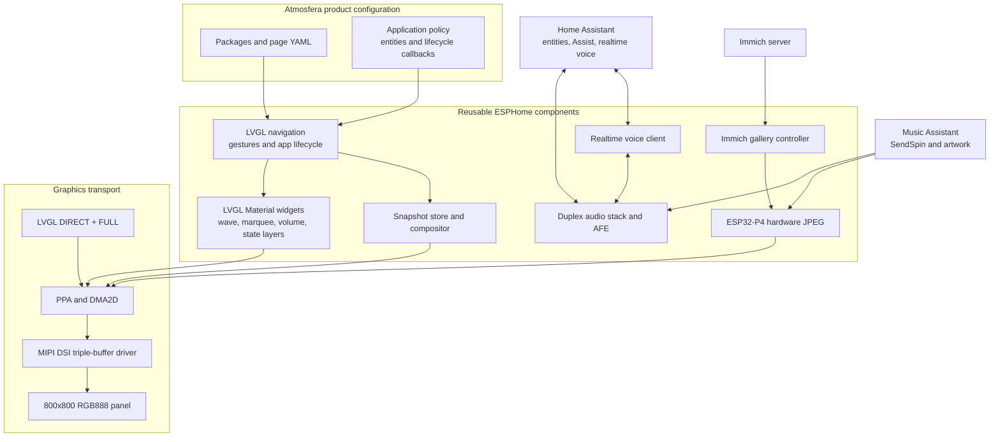

# Runtime architecture

This directory is the source of truth for how Atmosfera Echo Hub runs. It
describes the validated architecture, not every historical experiment. The
current checkpoint targets ESPHome `2026.8.0-dev`, ESP-IDF `5.5.5`, an
ESP32-P4, and an 800x800 RGB888 MIPI DSI panel.

Read this document first, then continue with:

- [Graphics and display pipeline](graphics.md)
- [Navigation and snapshot lifecycle](navigation-snapshots.md)
- [Audio and voice architecture](audio-voice.md)
- [Runtime tasks and memory](runtime-memory.md)
- [Architecture decision log](decisions.md)
- [Extending the UI](../development/extending-ui.md)
- [Validation and regression testing](../development/validation.md)
- [Productionization roadmap](../productization.md)

## Architectural goals

The runtime is designed around five constraints:

1. DSI scanout must keep receiving pixels even when LVGL, JPEG, audio, or WiFi
   is busy.
2. Repeated motion must not redraw a large LVGL object tree on every frame.
3. Full-screen RGB888 allocations must be bounded and have explicit owners.
4. Audio capture and playback must remain deterministic during full-duplex
   voice sessions.
5. Product behavior belongs in clean YAML while reusable state machines belong
   in ESPHome components.

## System overview

## What is universal

The project has moved substantial behavior into reusable components, but a new
view is not automatically optimized merely because it uses LVGL.

| Capability | Scope | What a new view must do |
| --- | --- | --- |
| MIPI DSI triple buffering | Automatic for the configured display | Nothing; use the display through LVGL or the documented manual-present API |
| LVGL `DIRECT` plus `FULL` rendering | Automatic for all LVGL pages | Avoid assumptions that partial invalidation reduces the final frame transfer |
| DMA2D/PPA helpers | Reusable API | Choose a supported format and respect ownership/cache contracts |
| Declarative gesture arbitration | Reusable | Register the home roots, application, blockers, and thresholds |
| Home snapshot paging | Reusable controller | Add the page root and corresponding indicator to `navigation.home` |
| Application open/close animation | Reusable controller | Register the application and provide only its policy callbacks |
| Snapshot-backed list scrolling | Reusable controller | Register the scroll region and its limits |
| Direct Material renderers | Reusable widgets | Declare the component and pause it when another full-screen owner takes over |
| Roboto and Material Symbols | Shared product convention | Use the shared font IDs; it is not imposed by LVGL itself |
| Voice session flow | Reusable transport plus product policy | Bind the post-AFE microphone, speaker, wake words, and UI phase callbacks |

## What is still product-specific

The following details must not be mistaken for generic ESPHome behavior:

- Four current Home pages and their widget IDs.
- The current 800x800 clock and page-indicator overlay coordinates.
- Circular application transitions and the assumption of a square display.
- Player, Settings, Voice Assistant, and Immich lifecycle policy.
- Hardware GPIOs, panel timings, audio codecs, and TDM slot assignment.
- A three-slot Home cache tuned for four pages.
- The 244x244 wavy media control geometry.
- Product-specific cleanup still implemented in lifecycle lambdas.

These are deliberate migration boundaries. New reusable code must derive
dimensions and formats from configuration, while product YAML may retain the
actual layout values.

## Configuration entry points

The product entry point is `atmosfera-echo-hub.yaml`. Its packages are grouped
by responsibility:

| Area | Primary path |
| --- | --- |
| Common runtime and settings | `modules/common/` |
| Panel, touch, and audio hardware | `modules/hardware/` |
| LVGL base, fonts, navigation, and pages | `modules/lvgl/` |
| Music and artwork behavior | `modules/player/` |
| Immich gallery | `modules/immich/` |
| Voice assistant | `modules/voice_assistant/` |

Reusable implementations are imported from the consolidated ESPHome
integration tree configured by `modules/common/external_components.yaml`.

## Sources of truth

When documentation and code differ, use the following precedence:

1. The currently flashed and hardware-validated integration commit.
2. Reusable component source and its schema.
3. Product YAML.
4. This architecture guide.
5. Historical investigation notes.

After changing the first three, update this guide in the same change.
