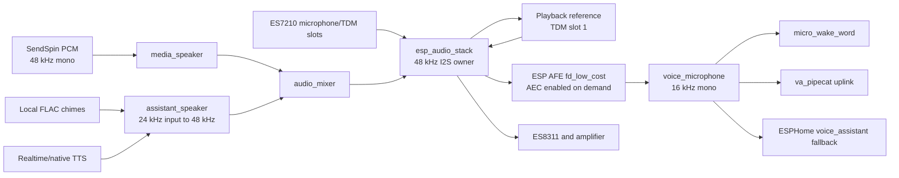
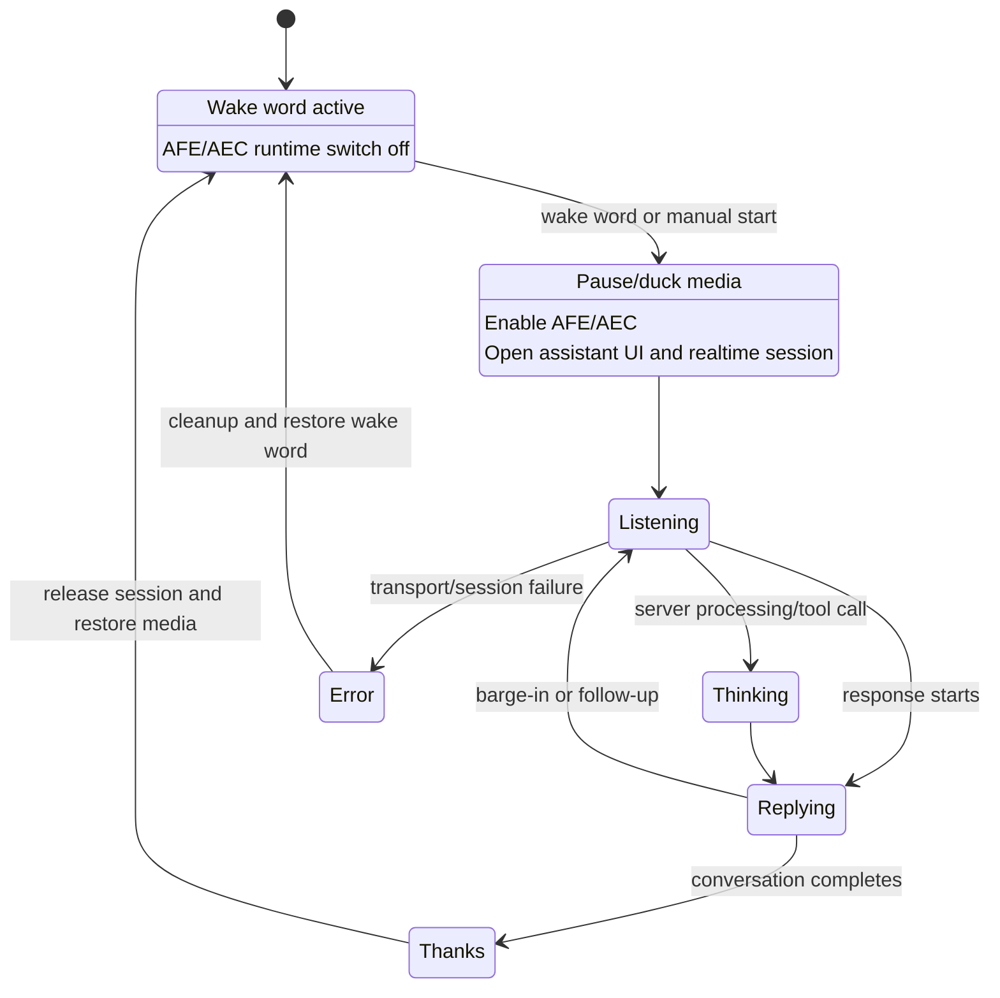
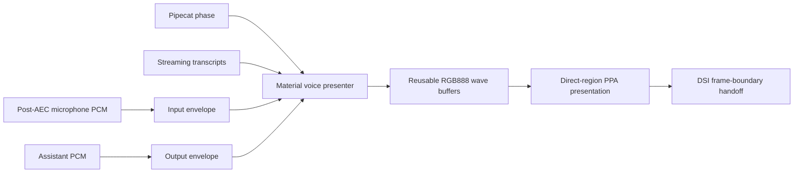

# Audio and voice architecture

The device has one coordinated duplex audio transport. Music, local chimes,
assistant playback, microphone capture, and AEC share the same physical I2S
clock domain and must not create independent hardware owners.

## Hardware topology

| Function | Configuration |
| --- | --- |
| I2S sample rate | 48 kHz |
| Processed microphone rate | 16 kHz |
| Sample and slot width | 16 bit |
| Bus mode | Four-slot TDM |
| Microphone codec | ES7210 at `0x40` |
| Output codec | ES8311 at `0x18` |
| Microphone slots | 0 and 2 |
| Playback-reference slot | 1 |
| AEC reference alignment | Previous frame |
| Amplifier enable | GPIO53, default off |
| Physical output | Mono |

The current AFE configuration uses one microphone in `mr` input format. The
board exposes more microphone data, but multi-microphone separation is not
enabled because the measured CPU cost conflicted with realtime output and UI.

## Audio graph

`esp_audio_stack` is the only physical I2S owner. The speaker abstraction,
mixer, and resamplers feed it through bounded ring buffers.

## Full duplex and AEC

Full duplex means:

1. microphone frames continue arriving while music or assistant audio plays;
2. the exact playback signal is provided as a reference to the AFE;
3. the AFE subtracts echo and emits post-AEC microphone audio;
4. the voice transport may keep transmitting microphone data during TTS;
5. near-end speech can interrupt the assistant.

It does not mean separate, unsynchronized input and output peripherals.

The playback reference comes from the TDM reference slot and uses the previous
frame for timing alignment. AEC is enabled in the AFE configuration but its
runtime switch is normally off. Enabling `voice_audio_processing_switch`
activates processing for a conversation without rebuilding the hardware
pipeline.

Noise suppression, speech enhancement, AGC, and continuous local VAD are
disabled. Reasons:

- ESP-SR warns that NS may reduce recognition accuracy;
- multi-microphone BSS/SE consumed too much CPU in the current workload;
- continuous VAD kept a background microphone consumer active and could starve
  the post-AFE path;
- the realtime backend already performs semantic and server-side VAD.

## Idle versus conversation

The expensive processing path is active only between `Opening` and final
cleanup. Idle wake-word detection continues to consume microphone frames, but
does not require the full AFE feature set.

## Realtime conversation flow

The primary conversational transport is the external `va_pipecat` component:

1. A wake word or manual Assistant tile opens the registered Voice app.
2. Music is paused or ducked according to product policy.
3. AFE/AEC is enabled.
4. The persistent, authenticated Pipecat WebSocket is already warm and a new
   wake turn begins.
5. `voice_microphone` streams 16 kHz mono PCM through a PSRAM uplink ring.
6. Server phase, transcript, and normalized PCM-envelope events update the
   assistant presentation.
7. Incoming 24 kHz mono TTS enters a PSRAM playback ring.
8. `assistant_speaker` resamples to the 48 kHz mixer/output path.
9. During reply, microphone streaming remains active for barge-in.
10. Final cleanup disables AFE, restores idle wake words, and resumes media if
    the conversation actually ended.

The playback ring defaults to a 300 ms prebuffer. The backend may tune this at
runtime. The goal is to absorb network jitter without delaying the first audio
more than necessary.

The backend endpoint is provisioned automatically. `va_pipecat` registers a
hidden native API action, and the Pipecat Assist add-on sends the complete
authenticated WebSocket URL after discovering the device in Home Assistant.
The token is not stored in an HA text entity or logged by the firmware. A
periodic re-provision makes device and Home Assistant restarts self-healing.

The microphone callback is gated while no conversation is active. It does not
retain or replay pre-roll, so wake chimes and their acoustic tail cannot leak
into the next Pipecat turn. Speech should begin when the listening state is
visible.

## Voice assistant presentation

The Voice application is a full-screen black scene with no on-screen controls.
It is closed only through the normal application-close gesture, which also
terminates the Pipecat session. The visual hierarchy is:

1. a small phase label at the top (`Listening`, `Thinking`, `Answering`,
   `Thanks`, or an error state);
2. a bounded rolling dialog in large centered paragraphs;
3. a three-line purple waveform over a bottom-anchored purple gradient.

The dialog keeps at most three paragraphs: the immediately preceding assistant
answer in white, the current user turn in gray, and the current assistant
answer in white. When a follow-up starts, the older user paragraph is removed,
the preceding assistant answer moves up, and the new user paragraph enters
below it. This preserves conversational order without allocating an unbounded
history or another display-sized surface. If the three blocks exceed the text
region, they are bottom-aligned so the newest turn remains visible.

Navigation is the sole owner of Voice visibility. A wake word must open the
registered `voice_application` through `lvgl.navigation.open`; it must not
directly unhide the overlay or activate the waveform. This guarantees that the
black LVGL surface has completed its transition before the direct presenter can
draw and that the close gesture owns an active application even before the user
speaks.

Backend phase and transcript callbacks only update content inside an already
open Voice application. A local close sets `voice_assistant_stop_requested`
before sending `end_session()`, so delayed `listening`, `replying`, transcript,
or idle callbacks cannot reopen the scene while navigation returns to Home.
Clear that latch only when a new navigation-owned Voice opening begins.

A wake-word opening records whether the backlight was off before `display_wake`
runs. A terminal Pipecat reply enters `thanks`; the device component keeps that
state visible for 1200 ms and then emits `idle`. This terminal `idle` closes the
navigation-owned Voice application. Only after the close transition completes
may the backlight return to its recorded off state. A Voice session opened from
an already-lit display returns to Home without changing display power. Manual
tile and diagnostic opens always count as display-on origins.

The Pipecat bridge must not expose raw model tokens as display events. It
normalizes cumulative and token-style sources, accumulates each RTVI observer
(`bot-output`, transcription, TTS text, and LLM text) independently, selects
one authoritative source by priority, and emits cumulative phrases: four words
for user partials and six
words for assistant partials, or earlier at punctuation and at turn end. A
pending final phrase may share one protocol message with the following phase;
the ESPHome parser therefore processes both fields instead of returning after
the transcript. This preserves the final words without briefly losing the
`listening`, `thanks`, or terminal transition. Never append chunks from two
assistant observers to one accumulator: differing chunk boundaries and
punctuation can otherwise duplicate a complete clause on the device.

Device-side transcript updates remain latest-wins and are committed at most
every 100 ms. A new paragraph fades and translates into place over seven 33 ms
steps; the bounded dialog shifts upward in the same animation, while cumulative
phrase continuations update in place. Streaming text therefore does not restart
the entrance animation or create a second raster pass.

The declarative LVGL phase and transcript labels define geometry, fonts,
colors, and wrapping only. After setup the material presenter hides them and
owns two fixed RGB888 direct regions: one for status and one for the complete
transcript panel. It rasterizes UTF-8 glyphs with the configured immutable LVGL
fonts into reusable PSRAM buffers and submits only those regions through the
regional PPA presenter. The entrance fade and vertical translation are also
drawn inside the transcript region. The wave frame is scheduled before phrase
rasterization so a 30-45 ms PSRAM text pass cannot postpone the independent
wave worker. Live text must never be switched back to native label updates: in
RGB888 DIRECT mode that invalidates a large native area, runs font/layout work
in the LVGL loop, and stalls the independent wave. The presenter never
allocates a full-screen text buffer or allocates per phrase.

`va_pipecat.on_audio_level` publishes separate normalized input and output PCM
envelopes. The presenter selects input while listening and output while
speaking, applies its own attack/release smoothing, and falls back to a slow
breathing wave during thinking or silence. It never reads PCM directly.

The waveform is not an LVGL object tree animation. A low-priority raster worker
builds one 660x190 RGB888 region in two reusable presentation slots while the
regional PPA compositor runs on the other core. The renderer owns exactly one
backdrop and two in-flight buffers (1,128,600 bytes total) for its lifetime,
does not allocate per frame, and coalesces work when both slots are busy. Each
slot tracks the rows touched by its previous wave and restores only that dirty
vertical span from the immutable backdrop before reuse; copying the complete
660x190 backdrop every frame wastes PSRAM bandwidth. Stopping the application
drains both slots before releasing the direct region.

At the validated 30 Hz setting, the dynamic Listening/Answering benchmark
presents 60-61 frames per two seconds with request, render, and submit counts
equal and no slot starvation. Dynamic raster work averages roughly 10-13 ms
and regional presentation roughly 9 ms. With the real microphone and AFE
active, the presenter remains at about 30 FPS and raster work averages 5-6 ms.
The media-player direct presenters must be quiesced before Voice takes the
region queue; deliberately running both workloads reduced the wave to roughly
15-23 FPS. A full-screen diagnostic JPEG capture is a separate stress
operation and must not be included in these steady-state figures.

Native LVGL text invalidation is expensive in RGB888 DIRECT mode. Before the
direct text regions, a synthetic word-at-a-time stream reduced the wave to
5.4-22.9 FPS and produced 187-283 ms LVGL loop spikes; even phrase updates
caused 116-161 ms stalls. With phrase batching and direct text presentation,
the cumulative-phrase benchmark keeps the wave at 28.8-30.4 FPS after the
initial full-page handoff, bounds the LVGL loop to 1-8 ms, and reports zero
native invalidated areas, zero native invalidated pixels, and zero DSI
underruns. The one-time first acquisition of the three direct regions measured
23.3 FPS and is tracked separately from streaming phrase updates. Phrase
batching remains part of the wire contract because it avoids unnecessary
raster submissions, while the direct regions remove the full-screen LVGL
refresh from the critical path.

## Barge-in

During `replying`, post-AEC microphone audio is still transmitted. When speech
is detected:

1. the device sends an interrupt;
2. pending assistant audio is flushed or suppressed;
3. the backend cancels the active response;
4. phase moves directly to `listening`;
5. user audio continues in the same session.

There must not be an intermediate `idle` phase between `replying` and a valid
follow-up. `idle` means the conversation has ended and may resume music, which
would contaminate the next microphone turn.

The `stop` wake-word model is enabled only where product policy needs a spoken
conversation stop. A manual close must call session termination, stop
assistant output, disable AFE, and restore the normal wake-word model.

## Phase ownership

The backend owns conversational phases:

| Phase | UI | Audio policy |
| --- | --- | --- |
| `idle` | Assistant hidden after cleanup | AFE off, normal wake word active, media may resume |
| `listening` | Listening scene and user transcript | AFE on, mic streaming |
| `thinking` | Thinking state; keep Assistant visible | AFE on, media remains paused |
| `replying` | Answering scene and assistant transcript | TTS playing, mic still streaming |
| `thanks` | Short completion state | Drain output, then cleanup |
| error/not ready | Error state and chime | Stop broken session, return to idle wake if possible |

These phases also own display power policy. While the backend reports
`waiting`, `listening`, `thinking`, or `replying`, the inactivity epoch is
refreshed regardless of `ui_active_app`. Navigation can lag a wake event or
temporarily change overlay ownership; neither is permission to turn the panel
off during a live conversation. Once the protected phase ends, a complete new
timeout interval starts.

The device must not invent a `thinking` transition merely because no audio is
currently playing. It follows the backend phase message.

## Native Home Assistant fallback

The ESPHome `voice_assistant` component remains configured for Home Assistant
Assist fallback behavior, timers, and compatibility. It uses the same
post-AFE microphone and assistant speaker. It is not allowed to compete with
the realtime session for microphone or output ownership.

Only one session controller may be active. Product scripts arbitrate wake word,
realtime, and native paths.

## Mixer and media policy

The mixer has two sources:

- `media_mixing_input`, with a 100 ms source buffer;
- `assistant_mixing_input`, with a 1000 ms source buffer.

SendSpin requests lossless mono PCM at 48 kHz. This avoids decoding stereo FLAC
on the P4 only to downmix it later. The SendSpin source owns a bounded 600,000
byte PSRAM buffer and an adjustable initial synchronization delay.

Announcements and assistant audio use the assistant source and duck media by
20 dB. Media is unducked only after:

- assistant output is drained;
- the conversation is truly idle;
- no timer announcement is active.

## Local sounds and amplifier sequencing

Boot, listening, and error sounds are local FLAC assets exposed through
ESPHome's `audio_file` and `media_source.audio_file` components. They use the
same announcement pipeline as voice output; there is no separate ad hoc codec
or I2S writer.

The amplifier defaults off. It may be enabled only after:

- I2C codecs are configured;
- I2S channels and DMA buffers exist;
- the output chain has been primed or is ready to receive silence/audio.

This ordering avoids the boot pop caused by exposing codec and DMA startup
transients to the physical speaker.

## Task placement

| Task | Core | Priority | Purpose |
| --- | --- | --- | --- |
| Audio stack | Core 0 by default | 19 | I2S RX/TX and frame processing |
| AFE feed manager | Core 0 | 10 | Move physical frames into ESP-SR |
| AFE processing/fetch | Core 1 | 10 | AEC and processed microphone output |
| Realtime playback drain | Unpinned | 11 | Drain 24 kHz TTS into assistant speaker |
| Realtime microphone TX | Unpinned | 6 | Send microphone chunks over WebSocket |

The audio task is above lwIP priority 18 but below WiFi priority 23. Do not
raise UI workers above it. Visual work may drop/coalesce frames; audio cannot
drop timing deadlines without audible corruption.

## Buffer rules

- Audio rings may live in PSRAM, but I2S DMA descriptors and hardware DMA
  buffers require suitable internal/DMA-capable memory.
- Audio callbacks must not allocate, log verbosely, perform HTTP work, or call
  LVGL.
- Cross-task state is atomic or passed through bounded queues/rings.
- Flush requests are executed by the audio owner, not by concurrently mutating
  ring-buffer internals from the main loop.
- Start/stop must wait for the audio task state machine rather than repeatedly
  creating and deleting I2S tasks.
- AEC reference and microphone frames must remain aligned; changing channel or
  slot mappings requires a loopback test.

## Failure signatures

| Symptom | First suspects |
| --- | --- |
| Wake word works, conversation mic is silent | AFE runtime switch, consumer ownership, stale ring, or session not committing mic |
| Assistant voice is high-pitched | 24/48 kHz format mismatch or duplicate resampling |
| TTS breaks up | Playback prebuffer, audio task starvation, WiFi delivery, or ring underrun |
| Music breaks up only during voice | AFE CPU load, incorrect media pause/duck policy, or PSRAM contention |
| Assistant hears itself | Missing/wrong playback reference, AEC disabled, or reference-frame misalignment |
| Barge-in switches to listening but hears nothing | Output not flushed, mic gate not reopened, or backend immediately sends idle |
| Boot pop | Amplifier enabled before codec/I2S stabilization |
| `Cannot receive audio, buffer is full` | Output not drained or stale session/audio generation |

## Source map

Reusable implementation:

- `esphome/components/audio_processor/`
- `esphome/components/esp_afe/`
- `esphome/components/esp_audio_stack/`
- `pipecat-homeassistant/components/va_pipecat/`
- `esphome/components/sendspin/`

Product configuration and policy:

- `modules/hardware/audio.yaml`
- `modules/voice_assistant/runtime.yaml`
- `modules/player/runtime.yaml`
