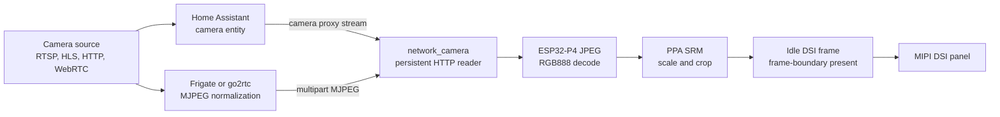

# Camera streaming

The camera application treats Home Assistant, Frigate, or go2rtc as the
protocol gateway and the ESP32-P4 as a low-latency MJPEG endpoint. RTSP, HLS,
WebRTC, authentication, and camera-specific quirks stay on the server. The
device receives complete JPEG frames, decodes them with the ESP32-P4 JPEG
peripheral, and presents them through PPA without redrawing the LVGL tree.

## Data path



Home Assistant exposes camera proxy endpoints and can proxy authenticated
camera entities. A bearer token can be supplied with `request_headers` when a
deployment uses that path. For cameras already managed by Frigate, its go2rtc
instance is the preferred normalization point because it avoids decoding and
encoding the stream in Home Assistant Core.

Useful upstream references:

- [Home Assistant camera proxy integration](https://www.home-assistant.io/integrations/proxy/)
- [Home Assistant REST API](https://developers.home-assistant.io/docs/api/rest/)
- [go2rtc](https://github.com/AlexxIT/go2rtc)
- [Frigate go2rtc configuration](https://docs.frigate.video/guides/configuring_go2rtc)

## Component contract

`network_camera` is a reusable ESPHome image source for ESP32-P4 and ESP-IDF.
It accepts one or more MJPEG URLs and exposes normal ESPHome actions:

```yaml
network_camera:
  id: entrance_camera
  sources:
    - name: Entrance
      url: https://home.example/api/camera_proxy_stream/camera.entrance
      request_headers:
        Authorization: !secret home_assistant_bearer
  frame_interval: 40ms
  max_frame_size: 768kB
  release_buffer_on_stop: true

script:
  - id: open_camera
    then:
      - network_camera.start: entrance_camera
  - id: close_camera
    then:
      - network_camera.stop: entrance_camera
```

The component deliberately does not implement RTSP, HLS, or WebRTC clients.
Adding each protocol to firmware would increase flash, heap use, reconnect
state, and latency queues. Server-side normalization also lets one YAML source
work with Home Assistant cameras from different manufacturers.

## Buffer ownership

The stream uses two large allocations at most:

| Buffer | Default/product size | Owner | Lifetime |
| --- | ---: | --- | --- |
| Encoded JPEG input | 512 KiB / 768 KiB | `network_camera` worker | Component lifetime |
| Decoded RGB888 frame | Source dimensions x 3 | Hardware JPEG image lease | Active stream only |

The HTTP read buffer is 8 KiB of internal RAM. The decoded frame is reused in
place. Decode starts only while no presenter holds a source lease; a busy
frame is dropped rather than queued. The previous DSI frame therefore remains
visible while a replacement is being decoded.

`release_buffer_on_stop: true` releases the decoded RGB888 allocation after
the camera application closes. The smaller encoded buffer stays allocated to
avoid fragmenting PSRAM on every reconnect.

## Scheduling and latency

The network reader runs in a dedicated, normally unpinned FreeRTOS task. It:

1. keeps one HTTP connection open;
2. extracts JPEG SOI/EOI frames without copying multipart headers;
3. drops frames that arrive before `frame_interval`;
4. decodes directly into the reusable RGB888 destination;
5. publishes a generation number only after hardware decode completes.

`lvgl_image_presenter` runs in continuous direct mode. A new generation is
scaled/cropped by PPA into an idle DSI frame and presented at a frame boundary.
No full-screen LVGL invalidation is needed for each camera frame.

On the validated 800x800 test stream this path measured approximately 22.5
FPS, 38-40 ms hardware decode time, zero component frame drops, and zero DSI
underruns. These figures are a checkpoint, not a guarantee for every network
or JPEG complexity.

## Application lifecycle

The product camera view is a normal declarative navigation application:

- opening animation uses its cached application snapshot;
- the stream starts only after the application is open;
- left/right swipe changes source;
- the global close gesture pauses and drains direct presentation;
- closing stops HTTP, releases the decoded image, and returns DSI ownership to
  navigation before revealing Home.

The direct camera frame covers the complete panel. LVGL remains active for
touch input, but ordinary LVGL overlays are not automatically composited over
that frame. Persistent controls should use a bounded direct-region renderer or
be deliberately burned into the camera destination; do not force a complete
LVGL redraw for every video frame.

## Failure policy

- Network timeout: keep the last complete frame and reconnect.
- Malformed or oversized JPEG: drop it and continue parsing.
- Decoder or source lease busy: drop the incoming frame; never build latency.
- Source change: disconnect, clear the parser, and wait for the first complete
  frame before replacing the display.
- Application close: stop presentation before releasing decoded memory.

Never make the stream smoother by increasing worker priority above audio,
WiFi, or display deadlines. First reduce source frame rate or JPEG complexity.

## Source map

- `esphome/components/network_camera/`
- `esphome/components/lvgl_image_presenter/`
- `modules/camera/runtime.yaml`
- `modules/lvgl/pages/camera.yaml`
- `modules/lvgl/base.yaml`
