# Camera streaming

The Camera application displays ordinary Home Assistant `camera.*` entities.
It does not require a matching Frigate `cameras:` entry, a manually configured
go2rtc stream, or a long-lived Home Assistant token in firmware. Frigate and
go2rtc remain useful protocol gateways, but they are implementation details of
the camera entity rather than an Atmosfera configuration requirement.

## Why a Home Assistant integration is required

The native ESPHome API authenticates Home Assistant as a client of the device.
It deliberately does not let firmware enumerate arbitrary Home Assistant
entities or create camera access tokens. The lightweight
`atmosfera_echo_hub` custom integration fills only that missing control-plane
gap. It runs inside Home Assistant Core; it is not an add-on, container, proxy
server, or second media pipeline.

The integration:

1. lets the user select and order existing `camera.*` entities in the Home
   Assistant config flow;
2. creates short-lived signed Home Assistant camera-proxy URLs;
3. discovers the local Home Assistant Core address reachable from the selected
   ESPHome device, without assuming a hostname, scheme, or port;
4. pushes names and URLs through the existing encrypted ESPHome API session;
5. refreshes rotating camera tokens without interrupting a healthy stream;
6. synchronizes source changes made in Home Assistant or on the display.

No camera password, bearer token, or ESPHome API key is copied into product
YAML. The signed URL is a runtime capability and is never persisted by the
firmware.

## Data path

```mermaid
flowchart LR
    SOURCE["Camera source<br/>Suntek, ONVIF, Frigate, vendor cloud, etc."]
    ENTITY["Home Assistant<br/>camera.* entity"]
    CONFIG["Atmosfera integration<br/>selected camera allow-list"]
    PROXY["HA camera_proxy_stream<br/>short-lived signed URL"]
    API["Existing ESPHome API session<br/>runtime source catalog"]
    HTTP["network_camera<br/>persistent MJPEG reader"]
    JPEG["ESP32-P4 JPEG peripheral<br/>direct RGB888 decode"]
    FALLBACK["Decoded RGB frame<br/>only for non-native geometry"]
    PPA["PPA SRM fallback<br/>scale and crop"]
    DSI["Idle DSI frame<br/>frame-boundary present"]
    PANEL["MIPI DSI panel"]

    SOURCE --> ENTITY
    ENTITY --> CONFIG
    CONFIG --> PROXY
    PROXY --> HTTP
    CONFIG --> API
    API --> HTTP
    HTTP --> JPEG
    JPEG -->|"native display geometry"| DSI
    JPEG -->|"other geometry"| FALLBACK
    FALLBACK --> PPA
    PPA --> DSI
    DSI --> PANEL
```



Home Assistant handles each camera's native authentication and transport. Its
camera proxy exposes MJPEG even when the underlying integration uses snapshots,
RTSP, HLS, or a vendor-specific API. If a Frigate camera is already registered
in Home Assistant, it follows exactly the same path as a non-Frigate camera.

## Home Assistant setup

Install the repository as a HACS custom integration, or copy
`custom_components/atmosfera_echo_hub` into Home Assistant's
`/config/custom_components` directory, then restart Home Assistant.

1. Open **Settings > Devices & services > Add integration**.
2. Choose **Atmosfera Echo Hub**.
3. Select the ESPHome device.
4. Select and order the existing Home Assistant cameras that this display may
   access.

The integration creates a **Camera source** select on the same device page.
Its options are the configured Home Assistant cameras. The same runtime list is
shown by the on-device picker in the Camera application. Edit the integration's
options to add, remove, or reorder cameras; no firmware rebuild is required.

A configured camera remains in the catalog while its entity is temporarily
unavailable. Selecting it shows the normal reconnect state until Home Assistant
can produce frames again.

## Runtime catalog contract

`network_camera` remains a reusable ESPHome image source. Static `sources` are
useful for standalone deployments, while `network_camera.replace_sources`
atomically replaces the catalog at runtime:

```yaml
network_camera:
  id: camera_stream
  max_runtime_sources: 16
  sources: []

api:
  actions:
    - action: camera_set_sources
      variables:
        names: string[]
        urls: string[]
      then:
        - network_camera.replace_sources:
            id: camera_stream
            names: !lambda 'return names;'
            urls: !lambda 'return urls;'
```

Catalog replacement is mutex-protected. The stream task copies the active
source before opening a connection, so an API update cannot invalidate memory
used by the HTTP worker. If names and order are unchanged, only signed URLs are
updated; the active connection is not restarted merely because a token rotated.
If the catalog changes, the current source is preserved by name where possible.

The product exposes two ESPHome user actions:

- `camera_set_sources(names, urls)` replaces the complete allow-list;
- `camera_select_source(index)` selects the same source as the Home Assistant
  select and the on-device picker.

The maximum catalog size is bounded at compile time by
`max_runtime_sources`; the product uses 16.

## Buffer ownership

The preferred native-geometry stream uses one component-owned large
allocation. Its decoded destination is an idle display-owned frame buffer, not
another camera allocation:

| Buffer | Product limit | Owner | Lifetime |
| --- | ---: | --- | --- |
| Encoded JPEG input | 768 KiB | `network_camera` worker | Component lifetime |
| Decoded RGB888 fallback | source dimensions x 3 | `network_camera` | Active stream, only when direct output is unsupported |
| Direct RGB888 output | display frame size | DSI driver lease | One frame decode/present operation |

The HTTP read buffer is internal RAM. When JPEG geometry, stride, color depth,
and order match the display, `network_camera` offers the complete encoded frame
to `lvgl_image_presenter`. The presenter leases an idle DSI frame and the
ESP32-P4 JPEG peripheral writes RGB888 directly into it. There is no decoded
camera buffer and no PPA copy in this path. A busy frame is dropped rather than
queued, and the previous complete DSI frame remains visible until replacement
decode finishes and the lease is presented at a frame boundary.

If the encoded frame cannot be written directly into a display lease, the
consumer returns `UNSUPPORTED`. `network_camera` then decodes into its reusable
RGB888 fallback buffer and the presenter uses PPA SRM for scale/crop. This keeps
the component generic without charging native 800x800 streams for an
unnecessary 1.92 MiB copy per frame.

`release_buffer_on_stop: true` releases the decoded RGB888 allocation when the
Camera application closes. The encoded buffer remains allocated to avoid PSRAM
fragmentation on every reconnect.

## Scheduling and presentation

The network reader runs in a dedicated FreeRTOS task. It:

1. keeps one HTTP connection open;
2. extracts complete JPEG frames from multipart MJPEG;
3. drops frames that arrive before `frame_interval`;
4. offers the encoded JPEG to a registered direct consumer;
5. decodes into an idle display frame with the ESP32-P4 JPEG peripheral when
   geometry matches, otherwise decodes into the reusable RGB888 fallback;
6. publishes a generation only after decode or direct presentation completes.

`lvgl_image_presenter` owns the direct framebuffer session while the full-screen
camera widget is visible. Native-size JPEG frames are decoded straight into an
idle display-owned frame and presented on a frame boundary. PPA scales and
crops only fallback frames whose geometry does not match the display. The
complete LVGL tree is not invalidated for every video frame.

The Suntek LTE camera validation used the Home Assistant proxy path, without
Frigate. A second validation source was registered in Home Assistant with its
built-in MJPEG Camera integration and then selected through the same runtime
catalog. On 2026-08-02, the moving 800x800 public aquarium source presented
10.3-14.7 FPS across cold-open and close/reopen tests. Decoded, direct-consumed,
and presented counters advanced one-for-one, hardware JPEG decode took about
39-45 ms, and no PPA frame copy was used. Starting the presenter before the
network source removed the first-frame RGB fallback allocation: camera-owned
memory now remains about 750 KiB while both active and idle, instead of rising
to about 2625 KiB. These are integration checkpoints, not guaranteed frame
rates for every camera or network.

## Application behavior

- Opening uses the normal cached application snapshot animation.
- Streaming starts after the application becomes active.
- Horizontal swipe or edge tap moves to the previous or next allowed camera.
- Tapping the center opens the camera picker.
- The global close gesture pauses and drains direct presentation before the
  decoded image is released.

The direct camera frame covers the panel. Persistent overlays must use a
bounded direct-region renderer or be deliberately composed into the destination
frame; forcing a full LVGL redraw per camera frame is not acceptable.

## Failure policy

- Network timeout: retain the last complete frame and reconnect.
- Malformed or oversized JPEG: drop it and continue parsing.
- Decoder or source lease busy: drop the incoming frame; never build latency.
- Source change: keep the old complete frame until the first new frame is
  decoded.
- Camera temporarily unavailable: keep it selectable and show reconnect state.
- Application close: stop presentation before releasing decoded memory.

## Source map

- `custom_components/atmosfera_echo_hub/`
- `esphome/components/network_camera/`
- `esphome/components/lvgl_image_presenter/`
- `modules/camera/runtime.yaml`
- `modules/lvgl/pages/camera.yaml`
- `modules/lvgl/base.yaml`

## Upstream references

- [Home Assistant camera component](https://github.com/home-assistant/core/blob/dev/homeassistant/components/camera/__init__.py)
- [Home Assistant config flows](https://developers.home-assistant.io/docs/config_entries_config_flow_handler/)
- [Home Assistant device registry](https://developers.home-assistant.io/docs/device_registry_index/)
- [ESPHome native API](https://esphome.io/components/api/)
- [Frigate go2rtc configuration](https://docs.frigate.video/guides/configuring_go2rtc)
