# Camera streaming

The Camera application displays ordinary Home Assistant `camera.*` entities.
It does not require a matching Frigate `cameras:` entry, a manually configured
go2rtc stream, or a long-lived Home Assistant token in firmware. Frigate and
go2rtc remain useful protocol gateways, but they are implementation details of
the camera entity rather than an Atmosfera configuration requirement.

## Why a Home Assistant integration is required

The native ESPHome API authenticates Home Assistant as a client of the device.
It deliberately does not let firmware enumerate arbitrary Home Assistant
entities or create camera access tokens. The lightweight
`atmosfera_echo_hub` custom integration fills only that missing control-plane
gap. It runs inside Home Assistant Core; it is not a separate add-on or
container. Its small authenticated HTTP view is the camera transport bridge,
not a second persistent media service.

The integration:

1. lets the user select and order existing `camera.*` entities in the Home
   Assistant config flow;
2. creates camera-access-token URLs for the display-oriented proxy bundled
   with the integration;
3. discovers the local Home Assistant Core address reachable from the selected
   ESPHome device, without assuming a hostname, scheme, or port;
4. pushes names and URLs through the existing encrypted ESPHome API session;
5. refreshes rotating camera tokens without interrupting a healthy stream;
6. synchronizes source changes made in Home Assistant or on the display.

No camera password, bearer token, or ESPHome API key is copied into product
YAML. The signed URL is a runtime capability and is never persisted by the
firmware.

## Data path

```mermaid
flowchart LR
    SOURCE["Camera source<br/>Suntek, ONVIF, Frigate, vendor cloud, etc."]
    ENTITY["Home Assistant<br/>camera.* entity"]
    CONFIG["Atmosfera integration<br/>selected camera allow-list"]
    PROXY["Atmosfera HA proxy<br/>native-size MJPEG"]
    API["Existing ESPHome API session<br/>runtime source catalog"]
    HTTP["network_camera<br/>persistent MJPEG reader"]
    JPEG["ESP32-P4 JPEG peripheral<br/>direct RGB888 decode"]
    FALLBACK["Decoded RGB frame<br/>only for non-native geometry"]
    PPA["PPA SRM fallback<br/>scale and crop"]
    DSI["Idle DSI frame<br/>frame-boundary present"]
    PANEL["MIPI DSI panel"]

    SOURCE --> ENTITY
    ENTITY --> CONFIG
    CONFIG --> PROXY
    PROXY --> HTTP
    CONFIG --> API
    API --> HTTP
    HTTP --> JPEG
    JPEG -->|"native display geometry"| DSI
    JPEG -->|"other geometry"| FALLBACK
    FALLBACK --> PPA
    PPA --> DSI
    DSI --> PANEL
```



Home Assistant handles each camera's native authentication and transport. If a
camera implements Home Assistant's native MJPEG handler, the proxy delegates to
that handler immediately. It must not require `async_get_image()` first: MJPEG
cameras can provide a healthy stream while exposing no still-image endpoint.
This fast path also avoids decoding and re-encoding every frame in Home
Assistant.

For cameras without a native MJPEG handler, the proxy requests a complete still
frame, normalizes it to the configured display geometry, and only then commits
the HTTP response. When such a camera exposes a usable stream and Home
Assistant has FFmpeg available, the proxy can convert it into native-size
MJPEG; otherwise it serves complete normalized still frames. A failed fallback
therefore cannot leave the device waiting behind an already-successful empty
response. Frigate and non-Frigate camera entities follow the same contract.

## Home Assistant setup

Install the repository as a HACS custom integration, or copy
`custom_components/atmosfera_echo_hub` into Home Assistant's
`/config/custom_components` directory, then restart Home Assistant.

1. Open **Settings > Devices & services > Add integration**.
2. Choose **Atmosfera Echo Hub**.
3. Select the ESPHome device.
4. Select and order the existing Home Assistant cameras that this display may
   access.

The integration creates a **Camera source** select on the same device page.
Its options are the configured Home Assistant cameras. The same runtime list is
shown by the on-device picker in the Camera application. Edit the integration's
options to add, remove, or reorder cameras; no firmware rebuild is required.

A configured camera remains in the catalog while its entity is temporarily
unavailable. Selecting it shows the normal reconnect state until Home Assistant
can produce frames again.

## Runtime catalog contract

`network_camera` remains a reusable ESPHome image source. Static `sources` are
useful for standalone deployments, while `network_camera.replace_sources`
atomically replaces the catalog at runtime:

```yaml
network_camera:
  id: camera_stream
  max_runtime_sources: 16
  sources: []

api:
  actions:
    - action: camera_set_sources
      variables:
        names: string[]
        urls: string[]
      then:
        - network_camera.replace_sources:
            id: camera_stream
            names: !lambda 'return names;'
            urls: !lambda 'return urls;'
```

Catalog replacement is mutex-protected. The stream task copies the active
source before opening a connection, so an API update cannot invalidate memory
used by the HTTP worker. If names and order are unchanged, only signed URLs are
updated; the active connection is not restarted merely because a token rotated.
If the catalog changes, the current source is preserved by name where possible.

The product exposes two ESPHome user actions:

- `camera_set_sources(names, urls)` replaces the complete allow-list;
- `camera_select_source(index)` selects the same source as the Home Assistant
  select and the on-device picker.

The maximum catalog size is bounded at compile time by
`max_runtime_sources`; the product uses 16.

## Buffer ownership

The preferred native-geometry stream uses one component-owned large
allocation. Its decoded destination is an idle display-owned frame buffer, not
another camera allocation:

| Buffer | Product limit | Owner | Lifetime |
| --- | ---: | --- | --- |
| Encoded JPEG input | 768 KiB | `network_camera` worker | Component lifetime |
| Decoded RGB888 fallback | source dimensions x 3 | `network_camera` | Active stream, only when direct output is unsupported |
| Direct RGB888 output | display frame size | DSI driver lease | One frame decode/present operation |

The HTTP read buffer is internal RAM. When JPEG geometry, stride, color depth,
and order match the display, `network_camera` offers the complete encoded frame
to `lvgl_image_presenter`. The presenter leases an idle DSI frame and the
ESP32-P4 JPEG peripheral writes RGB888 directly into it. There is no decoded
camera buffer and no PPA copy in this path. A busy frame is dropped rather than
queued, and the previous complete DSI frame remains visible until replacement
decode finishes and the lease is presented at a frame boundary.

If the encoded frame cannot be written directly into a display lease, the
consumer returns `UNSUPPORTED`. `network_camera` then decodes into its reusable
RGB888 fallback buffer and the presenter uses PPA SRM for scale/crop. This keeps
the component generic without charging native 800x800 streams for an
unnecessary 1.92 MiB copy per frame.

`release_buffer_on_stop: true` releases the decoded RGB888 allocation when the
Camera application closes. The encoded buffer remains allocated to avoid PSRAM
fragmentation on every reconnect.

The normal native 800x800 path therefore reports about 750 KiB both while
streaming and after close: that is the bounded encoded JPEG input allocation,
not a leaked display bitmap. After close, `has_frame` must be false and no
component-owned 1.92 MiB RGB888 frame may remain. A non-native source can
temporarily add its reusable decoded fallback; that allocation must disappear
on stop.

## Scheduling and presentation

The network reader runs in a dedicated FreeRTOS task. It:

1. keeps one HTTP connection open;
2. extracts complete JPEG frames from multipart MJPEG;
3. drops frames that arrive before `frame_interval`;
4. offers the encoded JPEG to a registered direct consumer;
5. decodes into an idle display frame with the ESP32-P4 JPEG peripheral when
   geometry matches, otherwise decodes into the reusable RGB888 fallback;
6. publishes a generation only after decode or direct presentation completes.

With `defer_direct_session_until_frame: true`, Camera does not take exclusive
display ownership while only its loading page is visible. The first complete
encoded JPEG sets an atomic readiness signal and is deliberately dropped. On
the next LVGL component-loop iteration, the LVGL task opens the direct DSI
session; the following JPEG is decoded directly into an idle display frame.
This keeps the native LVGL loader animating throughout network startup and
bounds the handoff gap to one source-frame interval.

The producer task must never open or close the DSI presentation session. ESP-IDF
uses task-owned FreeRTOS mutexes in that path, so acquiring from the network
worker and releasing from LVGL violates mutex ownership and can assert in
`xTaskPriorityDisinherit`. The network task only signals frame readiness and
offers encoded data. Session begin, pause, resume, and end all execute from the
LVGL task.

`lvgl_image_presenter` owns the direct framebuffer session while the full-screen
camera widget is visible. Native-size JPEG frames are decoded straight into an
idle display-owned frame and presented on a frame boundary. PPA scales and
crops only fallback frames whose geometry does not match the display. The
complete LVGL tree is not invalidated for every video frame.

The presenter also implements the shared `DirectSceneController` contract.
Before a global direct overlay captures the current screen, Camera pauses and
drains its full-screen DSI session. Incoming native JPEG frames are reported as
`DROPPED` while that pause is active, not `UNSUPPORTED`: otherwise the producer
would allocate and decode an unnecessary RGB888 fallback behind the overlay.
After the overlay restores its captured base, Camera resumes and the next
complete JPEG becomes visible. Gallery follows the same ownership protocol, so
the global volume renderer never races either full-screen producer.

The volume renderer also holds an LVGL framebuffer presentation session for
the complete gesture. This pauses the LVGL refresh timer and drains pending DSI
work before the dimmed frame is shown. Disabling invalidation alone does not
cancel an already queued native flush; such a flush would expose raw camera
rectangles between regional knob updates. The session is released only after
the complete undimmed camera frame has been restored. Camera then
synchronously reacquires its direct presentation session before LVGL
invalidation is enabled. This pins the restored video frame until the next
complete JPEG is ready and prevents the black native LVGL Camera page from
becoming an intermediate frame.

The Camera and Gallery loading pages are opaque black. Their spinner widgets
also paint an opaque black background with no border or shadow. Every spinner
invalidation therefore clears its complete redraw rectangle; stale scanlines
from a previous partial draw cannot survive below the animated arc.

Camera suppresses the global clock before its page is revealed and keeps it
hidden until the application closes. Volume activation still uses the clock's
top-centre touch coordinates, but the direct overlay is told that the widget
was not painted. It therefore dims the video frame without adding or removing
a clock-shaped patch, and restoring the overlay base cannot leave a black
rectangle behind.

The Suntek LTE camera validation used the Home Assistant proxy path, without
Frigate. A second validation source was registered in Home Assistant with its
built-in MJPEG Camera integration and then selected through the same runtime
catalog. On 2026-08-07, a controlled native 800x800, 10 FPS MJPEG source
presented at the full source rate with zero dropped frames. Hardware JPEG decode
took about 40 ms and frame presentation about 13.6 ms. This proves that the
device-side path sustains 10 FPS; it does not manufacture motion when a Home
Assistant camera only produces a new still every several seconds. Camera-owned
memory returned to about 750 KiB after stop. These are integration checkpoints,
not guaranteed frame rates for every camera or network.

## Application behavior

- Opening animates the shared black transition frame, so no stale camera frame
  appears before the loader. Closing captures and animates the current live DSI
  frame, then releases stream-owned resources after the handoff.
- If SendSpin is playing, Camera pauses it before starting decode. Closing the
  app resumes playback only when Camera owns that pause.
- Streaming starts after the application becomes active.
- Horizontal swipe or edge tap moves to the previous or next allowed camera.
- Tapping the center opens the camera picker.
- Confirming the already active camera closes the picker and resumes the
  existing presenter immediately. It must not rely on `select_source()` to do
  that work, because selecting an unchanged healthy source is intentionally a
  no-op and does not generate a new source revision.
- The global close gesture pauses and drains direct presentation before the
  decoded image is released.

The direct camera frame covers the panel. Persistent overlays must use a
bounded direct-region renderer or be deliberately composed into the destination
frame; forcing a full LVGL redraw per camera frame is not acceptable.

## Failure policy

- Network timeout: retain the last complete frame and reconnect.
- Malformed or oversized JPEG: drop it and continue parsing.
- Decoder or source lease busy: drop the incoming frame; never build latency.
- Source change: keep the old complete frame until the first new frame is
  decoded.
- Camera temporarily unavailable: keep it selectable and show reconnect state.
- Application close: stop presentation before releasing decoded memory.

## Source map

- `custom_components/atmosfera_echo_hub/`
- `esphome/components/network_camera/`
- `esphome/components/lvgl_image_presenter/`
- `modules/camera/runtime.yaml`
- `modules/lvgl/pages/camera.yaml`
- `modules/lvgl/base.yaml`

## Upstream references

- [Home Assistant camera component](https://github.com/home-assistant/core/blob/dev/homeassistant/components/camera/__init__.py)
- [Home Assistant config flows](https://developers.home-assistant.io/docs/config_entries_config_flow_handler/)
- [Home Assistant device registry](https://developers.home-assistant.io/docs/device_registry_index/)
- [ESPHome native API](https://esphome.io/components/api/)
- [Frigate go2rtc configuration](https://docs.frigate.video/guides/configuring_go2rtc)
