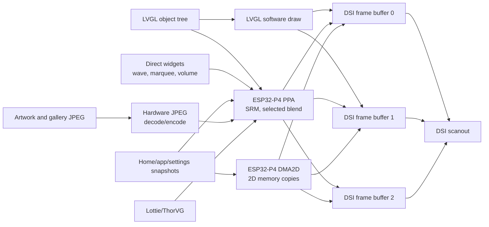
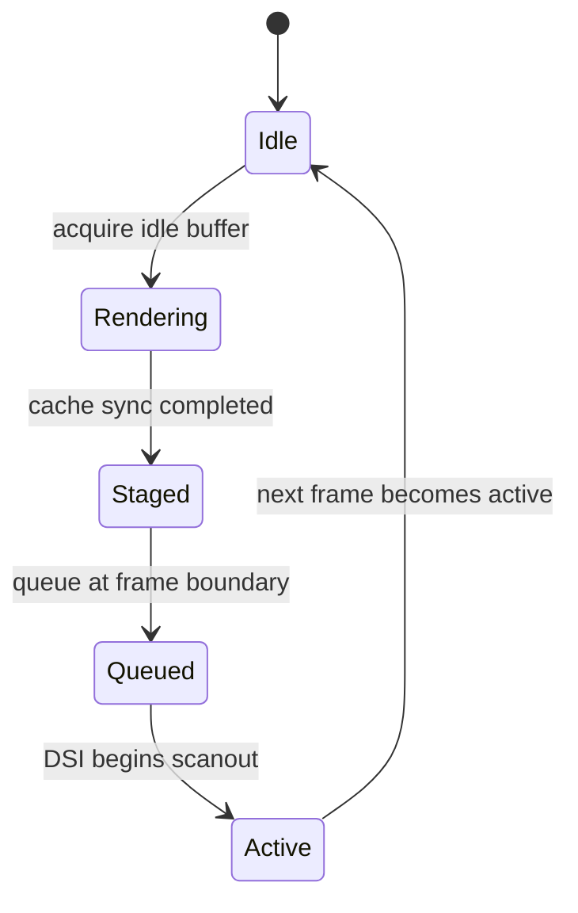
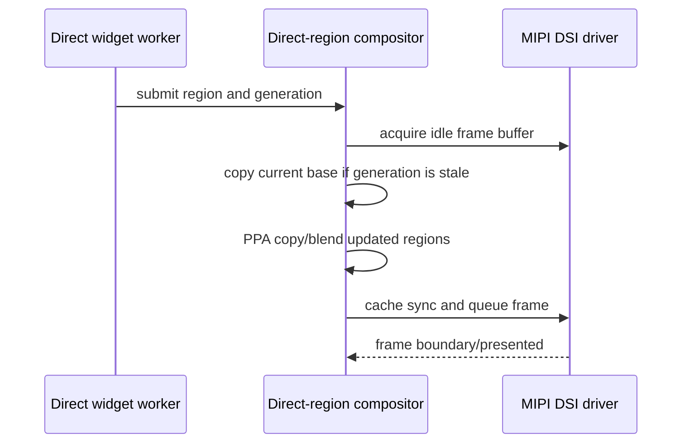

# Graphics and display pipeline

This document explains where pixels are produced, which accelerator moves
them, who owns each frame buffer, and why the firmware uses both PPA and
DMA2D.

## Validated display configuration

| Property | Value |
| --- | --- |
| Panel | Waveshare ESP32-P4 3.4-inch round panel |
| Logical size | 800x800 |
| Panel output | RGB888, 24 bits per pixel |
| LVGL color depth | 32-bit color semantics |
| LVGL render mode | `DIRECT`, using two full-screen buffers |
| LVGL refresh period | 10 ms |
| Display clock | 48 MHz |
| DSI lane bitrate | 1.5 Gbps |
| Frame buffers | Three, allocated and owned by the DSI display driver |
| LVGL buffers | Driver frame buffers 0 and 1 |
| Manual-compositor buffer | The currently idle member of the same three-buffer set |
| Byte order | `little_endian`, read from LVGL configuration |

LVGL uses 32-bit color semantics for widgets and sources that need alpha.
The panel scans RGB888, so the final display buffers use three bytes per pixel.
This distinction is important: an ARGB8888 source may be blended into an
RGB888 destination, but the display does not scan a four-byte framebuffer.

## Pixel path



The arrows show possible paths, not simultaneous writes. Buffer ownership
decides which destination is legal for a particular frame.

## Why `DIRECT` and full-screen buffers

`DIRECT` means LVGL draws into display-driver frame buffers rather than a
separate software staging buffer. It removes a mandatory full-frame copy.

The product currently also sets `full_refresh: true`, but `direct_mode: true`
has precedence when ESPHome calls `lv_display_set_buffers()`. The effective
LVGL mode is therefore `LV_DISPLAY_RENDER_MODE_DIRECT`, not
`LV_DISPLAY_RENDER_MODE_FULL`. Native LVGL refreshes may update only invalidated
areas, while LVGL keeps its two direct buffers coherent.

Full-screen buffers are still required because each direct buffer is a complete
scanout surface. Snapshot and direct-region compositors can acquire the third
idle DSI buffer, compose a complete frame there, and present it manually.

## Triple-buffer ownership

At 800x800 RGB888, one frame buffer is:

```text
800 * 800 * 3 = 1,920,000 bytes = 1.83 MiB
```

The three display-owned buffers therefore occupy 5,760,000 bytes, or about
5.49 MiB.



The driver tracks presented, active, queued, and staged indices atomically.
Manual rendering may only acquire a buffer that is none of those active
ownership states.

LVGL normally uses buffers 0 and 1. Buffer 2 is not a fourth hidden copy: it is
the third member of the same display-owned pool and provides an idle target for
snapshot and direct composition. After a manual frame is presented,
`realign_direct_buffer_after_manual_present()` reconnects LVGL to a coherent
base. When native LVGL resumes, the final manual frame is seeded into both LVGL
buffers through DMA2D. This is a transition-boundary copy, not a per-frame
copy.

Skipping this synchronization is valid only when the next owner explicitly
guarantees a complete redraw of the screen and every active overlay before
either LVGL buffer can be scanned. Invalidating only the active screen is not
enough when top-layer widgets or direct regions remain visible.

### Native `DIRECT` dirty-region handoff

Native LVGL rendering also has a frame-boundary ownership rule. LVGL can issue
several flush callbacks for one frame. During the intermediate callbacks, the
second LVGL buffer may still be the DSI scanout source and must not be updated
just to keep the two `DIRECT` buffers coherent.

The component therefore:

1. records dirty rectangles in a fixed-capacity list;
2. writes back only the newly rendered source rectangle after every flush;
3. presents the frame on the last flush;
4. waits for the DSI frame boundary;
5. copies the accumulated dirty rectangles into the now-idle LVGL buffer;
6. clears the list for the next frame.

Overlapping rectangles are merged. If the bounded list fills, it collapses to
one enclosing rectangle instead of allocating memory in the flush callback.
On a frame-boundary timeout, synchronization is skipped rather than risking a
write into the active scanout buffer. The warning
`DIRECT frame boundary timed out` must be treated as a display ownership
failure, not hidden by copying earlier.

## Accelerator responsibilities

### DMA2D

DMA2D is used for deterministic 2D memory movement:

- copying RGB888 spans and complete frames;
- asynchronous LVGL flush/staging work;
- selected application transition operations;
- hardware JPEG support and associated color conversion through the IDF
  integration patch;
- synchronizing complete bases when a consumer explicitly needs it.

The current M2M path batches aligned spans and uses internal-memory
descriptors. Cache synchronization surrounds DMA access. DMA2D is preferred
when the operation is fundamentally a copy and does not require geometric
sampling or alpha composition.

### PPA SRM

PPA scale/rotate/mirror is used for:

- RGB888 snapshot movement;
- image scaling and rotation;
- gallery pan and Ken Burns style transforms;
- direct-region copies;
- Lottie XRGB/ARGB conversion to the RGB888 display target;
- application transition geometry where supported.

SRM is the preferred accelerator for transformed images because it performs
sampling and destination writes without making the CPU touch every pixel.

### PPA blend

PPA blend is used only on validated explicit paths, such as compositing an
ARGB888 direct widget over an RGB888 base.

The generic LVGL RGB888 fill and blend draw-unit handlers remain restricted.
On ESP32-P4 they have produced short horizontal artifacts in cached PSRAM.
`use_ppa_blend: true` therefore means the capability is compiled and safe
explicit paths may use it; it does not mean every LVGL RGB888 blend operation
is routed through hardware.

Masked, rounded, unsupported, or small operations may still fall back to the
LVGL software renderer. This is intentional.

### Selection table

| Operation | Preferred engine | Reason |
| --- | --- | --- |
| Full RGB888 frame copy | DMA2D | Simple 2D copy with bounded descriptors |
| RGB888 image pan/scale/rotate | PPA SRM | Hardware geometric transform |
| ARGB8888 overlay on RGB888 base | Explicit PPA blend | Alpha composition without CPU pixel loop |
| Generic rounded LVGL widget | LVGL software or validated PPA path | Masks and RGB888 correctness take priority |
| JPEG decode/encode | ESP32-P4 JPEG peripheral | Avoid software codec and extra color pass |
| Home/app snapshot movement | PPA/DMA2D direct compositor | Avoid LVGL tree redraw |

## Direct-region compositor

The direct-region compositor updates a small dynamic region while preserving
the rest of the active frame. It is used by the wavy media control, marquee,
and volume overlay.

It owns:

- four registered region slots;
- an eight-request queue;
- a 6 KiB worker stack;
- a generation number for each DSI buffer;
- a barrier used by page and application handoff.



The generation mechanism prevents a region rendered over an old base from
being presented after LVGL or navigation has changed the screen. Before a
snapshot, page switch, or app transition, navigation pauses the region
compositor and waits on its barrier. Resuming increments the base generation.

No additional full-screen region buffer exists. The compositor uses the three
DSI buffers and bounded per-widget sources.

## Hardware JPEG path

Artwork, gallery images, and compressed snapshots use the ESP32-P4 JPEG
peripheral. The important rules are:

- derive RGB order and byte order from display/LVGL configuration;
- decode into a reusable destination with known stride and capacity;
- avoid an intermediate full-screen RGB buffer when the destination can be
  leased directly;
- synchronize only the written range before PPA, DMA2D, or DSI consumes it;
- keep the old image valid until the replacement is completely decoded;
- publish the new source atomically, then refresh the affected LVGL/direct
  region;
- release the replaced buffer only after no display or worker still references
  it.

The current artwork path reuses active buffer capacity and the gallery keeps a
bounded encoded buffer. A decoded 800x800 RGB888 image still costs 1.83 MiB;
hardware JPEG reduces codec CPU time and compressed storage, not the size of
the displayed pixels.

## Gesture velocity and snapshot lifecycle

The shared gesture router owns axis capture and release velocity. It measures
instantaneous velocity from touchscreen samples and preserves a whole-gesture
estimate for short, sparsely sampled flicks.

- Home hands horizontal release velocity to the snapshot compositor.
- The settle duration accounts for the initial derivative of LVGL cubic
  ease-out, so the first frame after release continues near the finger speed.
- Settings hands vertical velocity to the snapshot scroll compositor. The
  scroll controller must not calculate a second independently filtered
  velocity, because that suppresses short flicks.
- Product thresholds remain declarative. The round display currently uses a
  two-pixel start distance and one-pixel axis bias for Home and Settings.

Settings owns its decoded scroll bitmap only while the application is open.
Closing Settings, including while inertia is active, ends the scroll
compositor and releases that bitmap before the application close snapshot is
captured. Opening allocates one shared 1.83 MiB application work buffer;
closing returns roughly 3 MiB of transient PSRAM in the current build. Failed
work-buffer allocation and failed application capture emit a heap diagnostic
with the largest available block.

### Home tile-window ownership

Home keeps three decoded RGB888 slots for the visible page and its immediate
neighbours. Moving the three-page window can recycle one outgoing slot by
encoding its dirty contents and decoding the incoming page on a background
worker. The slot has explicit ownership while that work is in progress:

- a busy slot is not addressable through either its outgoing or incoming page;
- the `page -> slot` mapping is published only after the complete JPEG decode
  and required cache synchronization succeed;
- a failed or partial decode invalidates the slot mapping instead of exposing
  partially written pixels under the outgoing page;
- the swipe and JPEG workers are created while Home is prepared at boot, not
  on the first movement sample;
- the normal gesture-start path binds the already decoded slots only. Exposing,
  aligning, and laying out live LVGL page trees is reserved for the exceptional
  fresh-snapshot fallback;
- after settle, the exact final snapshot remains displayed until background
  prefetch finishes and the native target has been scheduled for redraw. The
  LVGL loop must not block waiting for the JPEG worker;
- the final handoff asks the navigation controller to re-establish exactly one
  visible, centred Home widget before invalidating it. Invalidating a widget is
  not sufficient if an interrupted transition left that widget hidden;
- `swipe_start_distance: 0` means capture on the first directional pixel, not
  on touch-down. With `axis_bias: 0`, a stationary touch remains a tap because
  neither axis wins until the coordinates actually change.
- Home defers delivery of the initial press to LVGL. A stationary tap is
  replayed as a short press/release pair, but a captured drag never applies a
  tile's pressed style and therefore cannot invalidate the tile at swipe start.
- A new touch during settle pauses the direct worker at its last presented
  coordinates. The next drag uses that offset as its origin, and crossing a
  page boundary rebases the current/next pair without ending direct ownership.
- Edge return uses smooth in/out timing rather than the committed-page
  velocity curve. Keep this policy separate so edge resistance can be softer
  without making ordinary page changes feel sluggish.

These rules prevent two distinct symptoms: a full-tree layout hitch at the
first captured pixels of a drag, and random black or partially decoded pages
when a recycled slot is read under its old identity.

On 2026-07-31 the 800x800 ESP32-P4 hardware tests exercised both cache windows,
edge bounce, cancelled drags, and first-pixel capture. An 84-gesture stress run
completed without a reset or DSI underrun. One compositor frame failed while
the API deliberately flooded the router; the handoff recovered and the native
Home page remained available.

## Lottie and vector animation

The Lottie JSON is small, but rendering is not free. ThorVG expands the vector
scene into working data and ultimately produces raster pixels. The boot
animation can optionally pre-render frames to PSRAM for stable playback. That
cache is approximately 11 MiB for the current asset and is deliberately:

1. allocated while PSRAM is still contiguous;
2. used for one-shot boot playback;
3. reduced to the final retained frame;
4. released before Home and application caches are completed.

PPA can accelerate conversion and presentation of opaque or alpha frames, but
it does not execute the Lottie vector scene itself. Smooth vector playback
therefore requires either bounded pre-rendering or a sufficiently light scene.

## Cache coherency rules

PSRAM is cached. Hardware engines and the CPU do not automatically see the
same bytes at the same instant.

Use the direction that matches ownership:

- CPU produced data, hardware will read: write back CPU cache to memory.
- Hardware produced data, CPU will read: invalidate CPU cache after hardware
  completion.
- Hardware produced data, another hardware engine will read: wait for the
  producer, synchronize the written range as required by the IDF API, then
  start the consumer.

Never synchronize an arbitrary full buffer merely because a small region
changed. Excessive cache operations consume the same PSRAM bandwidth needed by
DSI scanout.

## Failure signatures

| Symptom | First suspects |
| --- | --- |
| Blue full-screen flash | DSI starvation, illegal buffer ownership, missing frame acknowledgement, or excessive PSRAM/cache traffic |
| Horizontal short lines | RGB888 PPA fill/blend path, stale cache lines, wrong stride, or writing an active frame |
| Random horizontal split | Buffer switch before producer completion or incorrect frame stride |
| Correct frame after touching screen | Source changed without the required LVGL/direct refresh |
| Shifted image | DSI timing/mode mismatch, wrong stride, or source crop coordinates |
| Correct first image, corrupt replacements | Old/new buffer lifetime overlap or incomplete invalidation |
| Animation good until artwork update | Competing PSRAM transfer or direct-region base generation mismatch |

Do not hide these faults with a slower global burst setting until ownership and
coherency have been proven correct.

## Source map

Reusable implementation lives in the ESPHome integration tree:

- `esphome/components/mipi_dsi/mipi_dsi.cpp`
- `esphome/components/mipi_dsi/mipi_dsi.h`
- `esphome/components/lvgl/lvgl_esphome.cpp`
- `esphome/components/lvgl/dma2d_m2m_copy.cpp`
- `esphome/components/lvgl/ppa/`
- `esphome/components/lvgl/lottie_loader.h`
- `esphome/components/lvgl_material/`
- `esphome/components/esp32_jpeg/`

Product configuration lives in:

- `modules/hardware/display.yaml`
- `modules/lvgl/base.yaml`
- `modules/lvgl/material.yaml`
- `modules/player/artwork.yaml`
- `modules/immich/`

