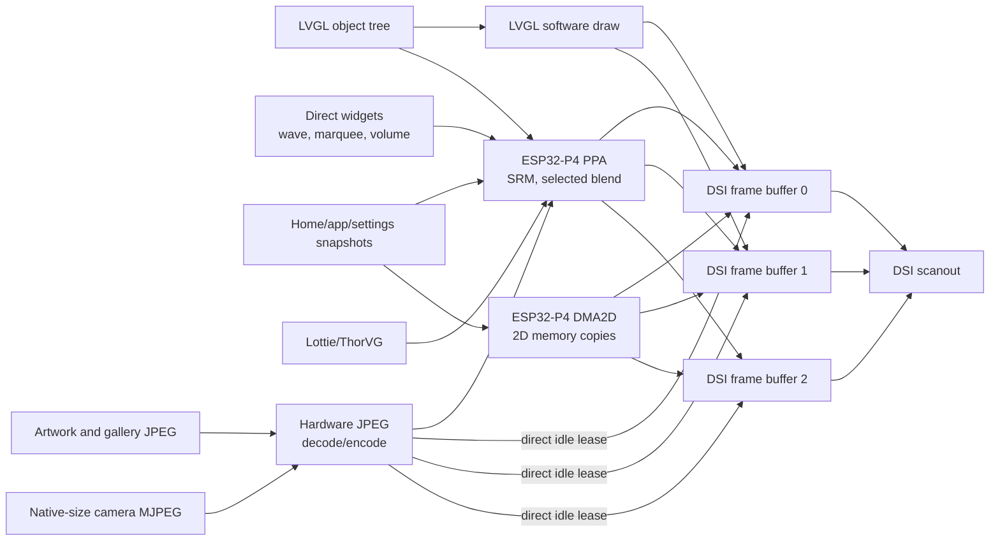
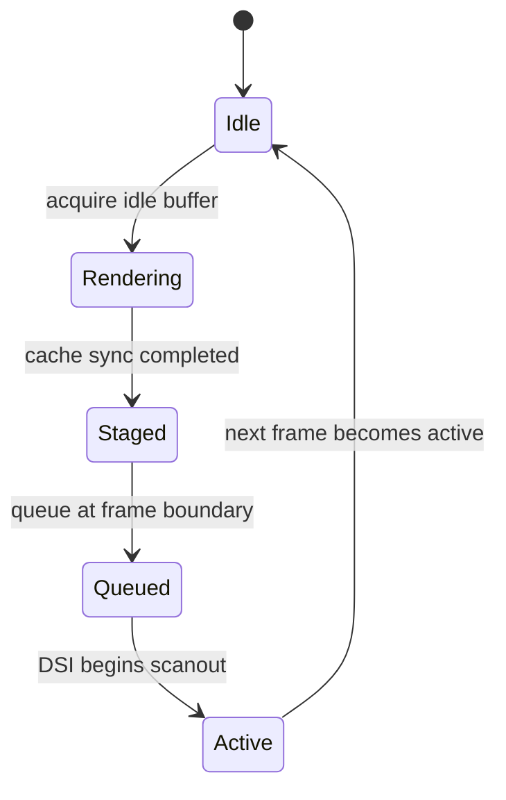
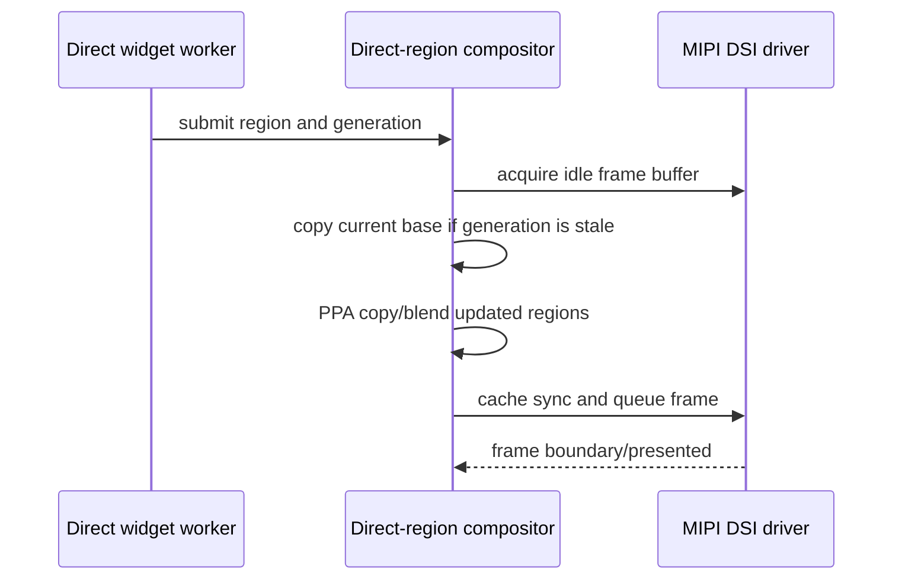

# Graphics and display pipeline

This document explains where pixels are produced, which accelerator moves
them, who owns each frame buffer, and why the firmware uses both PPA and
DMA2D.

## Validated display configuration

| Property | Value |
| --- | --- |
| Panel | Waveshare ESP32-P4 3.4-inch round panel |
| Logical size | 800x800 |
| Panel output | RGB888, 24 bits per pixel |
| LVGL color depth | 32-bit color semantics |
| LVGL render mode | `DIRECT`, using two full-screen buffers |
| LVGL refresh period | 10 ms |
| Display clock | 48 MHz |
| DSI lane bitrate | 1.5 Gbps |
| Frame buffers | Three, allocated and owned by the DSI display driver |
| LVGL buffers | Driver frame buffers 0 and 1 |
| Manual-compositor buffer | The currently idle member of the same three-buffer set |
| Byte order | `little_endian`, read from LVGL configuration |

LVGL uses 32-bit color semantics for widgets and sources that need alpha.
The panel scans RGB888, so the final display buffers use three bytes per pixel.
This distinction is important: an ARGB8888 source may be blended into an
RGB888 destination, but the display does not scan a four-byte framebuffer.

## Pixel path



The arrows show possible paths, not simultaneous writes. Buffer ownership
decides which destination is legal for a particular frame.

## Why `DIRECT` and full-screen buffers

`DIRECT` means LVGL draws into display-driver frame buffers rather than a
separate software staging buffer. It removes a mandatory full-frame copy.

The product currently also sets `full_refresh: true`, but `direct_mode: true`
has precedence when ESPHome calls `lv_display_set_buffers()`. The effective
LVGL mode is therefore `LV_DISPLAY_RENDER_MODE_DIRECT`, not
`LV_DISPLAY_RENDER_MODE_FULL`. Native LVGL refreshes may update only invalidated
areas, while LVGL keeps its two direct buffers coherent.

Full-screen buffers are still required because each direct buffer is a complete
scanout surface. Snapshot and direct-region compositors can acquire the third
idle DSI buffer, compose a complete frame there, and present it manually.

## Triple-buffer ownership

At 800x800 RGB888, one frame buffer is:

```text
800 * 800 * 3 = 1,920,000 bytes = 1.83 MiB
```

The three display-owned buffers therefore occupy 5,760,000 bytes, or about
5.49 MiB.



The driver tracks presented, active, queued, and staged indices atomically.
Manual rendering may only acquire a buffer that is none of those active
ownership states.

An external full-screen session, such as native-size camera presentation, is
the exclusive owner of this pool until it ends. The session pauses and drains
the direct-region compositor before acquiring its first lease. While the
session is active, the driver rejects frame queues from LVGL and independent
regional workers; otherwise a late widget frame can replace a camera frame or
leave LVGL with a stale base. On return, the active frame is made CPU-coherent,
the session ends, both LVGL direct buffers are realigned, and only then are
regional workers resumed.

LVGL normally uses buffers 0 and 1. Buffer 2 is not a fourth hidden copy: it is
the third member of the same display-owned pool and provides an idle target for
snapshot and direct composition. After a manual frame is presented,
`realign_direct_buffer_after_manual_present()` reconnects LVGL to a coherent
base. When native LVGL resumes, the final manual frame is seeded into both LVGL
buffers through DMA2D. This is a transition-boundary copy, not a per-frame
copy.

Skipping this synchronization is valid only when the next owner explicitly
guarantees a complete redraw of the screen and every active overlay before
either LVGL buffer can be scanned. Invalidating only the active screen is not
enough when top-layer widgets or direct regions remain visible.

### Native `DIRECT` dirty-region handoff

Native LVGL rendering also has a frame-boundary ownership rule. LVGL can issue
several flush callbacks for one frame. During the intermediate callbacks, the
second LVGL buffer may still be the DSI scanout source and must not be updated
just to keep the two `DIRECT` buffers coherent.

The component therefore:

1. records dirty rectangles in a fixed-capacity list;
2. writes back only the newly rendered source rectangle after every flush;
3. presents the frame on the last flush;
4. waits for the DSI frame boundary;
5. copies the accumulated dirty rectangles into the now-idle LVGL buffer;
6. clears the list for the next frame.

Overlapping rectangles are merged. If the bounded list fills, it collapses to
one enclosing rectangle instead of allocating memory in the flush callback.
On a frame-boundary timeout, synchronization is skipped rather than risking a
write into the active scanout buffer. The warning
`DIRECT frame boundary timed out` must be treated as a display ownership
failure, not hidden by copying earlier.

## Accelerator responsibilities

### DMA2D

DMA2D is used for deterministic 2D memory movement:

- copying RGB888 spans and complete frames;
- asynchronous LVGL flush/staging work;
- selected application transition operations;
- hardware JPEG support and associated color conversion through the IDF
  integration patch;
- synchronizing complete bases when a consumer explicitly needs it.

The current M2M path batches aligned spans and uses internal-memory
descriptors. Cache synchronization surrounds DMA access. DMA2D is preferred
when the operation is fundamentally a copy and does not require geometric
sampling or alpha composition.

### PPA SRM

PPA scale/rotate/mirror is used for:

- RGB888 snapshot movement;
- image scaling and rotation;
- gallery pan and slideshow transforms;
- direct-region copies;
- Lottie XRGB/ARGB conversion to the RGB888 display target;
- application transition geometry where supported.

SRM is the preferred accelerator for transformed images because it performs
sampling and destination writes without making the CPU touch every pixel.

### PPA blend

PPA blend is used only on validated explicit paths, such as compositing an
ARGB888 direct widget over an RGB888 base.

The generic LVGL RGB888 fill and blend draw-unit handlers remain restricted.
On ESP32-P4 they have produced short horizontal artifacts in cached PSRAM.
`use_ppa_blend: true` therefore means the capability is compiled and safe
explicit paths may use it; it does not mean every LVGL RGB888 blend operation
is routed through hardware.

Masked, rounded, unsupported, or small operations may still fall back to the
LVGL software renderer. This is intentional.

### Selection table

| Operation | Preferred engine | Reason |
| --- | --- | --- |
| Full RGB888 frame copy | DMA2D | Simple 2D copy with bounded descriptors |
| RGB888 image pan/scale/rotate | PPA SRM | Hardware geometric transform |
| ARGB8888 overlay on RGB888 base | Explicit PPA blend | Alpha composition without CPU pixel loop |
| Generic rounded LVGL widget | LVGL software or validated PPA path | Masks and RGB888 correctness take priority |
| JPEG decode/encode | ESP32-P4 JPEG peripheral | Avoid software codec and extra color pass |
| Native-size full-screen camera JPEG | JPEG directly to idle DSI frame | Avoid decoded RGB allocation and per-frame PPA copy |
| Home/app snapshot movement | PPA/DMA2D direct compositor | Avoid LVGL tree redraw |

## Reusable image scene transitions

`lvgl_image_presenter` separates image transport and decoding from display
presentation. The player uses it with `motion: none` and `crossfade: true`;
gallery and camera views can use the same owner with their own motion policy.

For a continuous source whose first frame may arrive much later than the page,
`defer_direct_session_until_frame` leaves LVGL in control of the loading scene.
The producer task signals that one complete encoded frame exists, while the
LVGL task owns the subsequent DSI-session begin/end lifecycle. The readiness
frame is dropped and the next frame enters the direct decode path. Never move
the session acquisition into the producer task: DSI presentation mutexes must
be released by the same task that acquired them.

On the validated ESP32-P4 RGB888 DSI path a crossfade does not create a second
LVGL image widget and does not invalidate the full screen for every animation
step. Its ownership sequence is:

1. `prepare_transition` runs before the decoder replaces or reuses the image
   source buffer and immediately takes direct-image ownership of the DSI pool.
   There must be no decoder-to-worker gap in which a dynamic region can queue
   a complete framebuffer from the previous artwork generation.
2. Registered dynamic regions keep producing updates, but while the scene
   transition owns DSI those updates only replace their cached ARGB overlays;
   they cannot independently present a framebuffer.
3. The currently presented DSI framebuffer remains the immutable old scene.
4. LVGL renders the complete incoming scene once into one temporary RGB888
   frame sized from the runtime display dimensions. The render includes the
   bottom, active-screen, top and system layers, so global overlays such as the
   clock survive the handoff.
5. Background copies required by direct widgets are completed before the
   crossfade starts. The player wave keeps three bounded RGB565 backdrop crops:
   active, in-flight and next. A replacement crop can therefore become active
   without waiting for, or overwriting, the source of an older PPA request. A
   task-owned PPA blend client then crossfades the old DSI frame into the final
   scene on the worker core. The pinned old DSI frame already contains the last
   direct overlay, so each direct region also preserves one compact clean
   background at transition start. After every full-frame blend, the compositor
   replaces that region with the matching clean old-to-new background blend and
   only then applies the newest registered ARGB overlay once. The player wave
   and marquee therefore remain live during an artwork change without briefly
   becoming thicker from two overlapping generations.
6. The final frame is handed back to LVGL and the temporary frame is released.

The presenter owns LVGL display invalidation for this entire transaction.
Decoder and product YAML callbacks must not toggle invalidation separately.
Every success, cancellation, timeout, and decode-error path returns ownership
through the presenter, which re-enables invalidation and invalidates the active
screen. This keeps panels opened during an artwork transition renderable rather
than merely visible in the LVGL object tree.

A direct region taking part in this transition is cached as a
background-independent ARGB overlay. Never preserve its already composited RGB
rectangle: that rectangle contains the artwork generation visible when it was
produced and can paste a second or third cover over the current crossfade. Both
the transition worker and live direct-region updates blend ARGB in place over
the current target framebuffer.

The one-shot LVGL render of the incoming scene must exclude any native widget
whose pixels are also preserved as a direct-region overlay. Otherwise the
crossfade frame contains the widget once and the direct compositor blends it a
second time. `capture_exclude` declares these objects for an image presenter;
the player excludes its native wavy-progress image and preserves only the live
ARGB direct region.

The source is allowed to reuse the same decoded allocation. The old pixels are
owned by the pinned DSI framebuffer, not by a second artwork allocation. This
is why pointer equality between the old and new image descriptors must not
disable the direct-scene path.

The first player artwork follows the same path even though the decoded image
widget is still hidden behind a separate placeholder. `prepare_transition`
pins that visible placeholder scene before JPEG decode. The completed scene
then reveals the artwork widget, hides the placeholder, and crossfades from the
pinned DSI frame without allocating a placeholder-sized image buffer.

Gallery motion is exposed as the `slideshow` image option and implemented by
`SlideshowController`. The name describes the reusable presentation owner; it
does not imply zoom. The current Atmosfera gallery configures pan-only motion.

Pausing the gallery for its controls does not recenter, retransform, or redraw
the source image. `pause_for_overlay()` copies the exact currently presented
DSI frame into one transient RGB888 surface, ends the direct slideshow lease,
and lets LVGL draw the controls over that frozen frame. Hiding the controls
returns ownership to the slideshow worker. This avoids the striped paused
frame previously produced by reconstructing a centered image through a second
render path.

Manual Previous and Next use that same frozen frame as the outgoing transition
source. The button handler hides the controls without resuming pan, fetches or
selects the requested image, and lets `transition_to()` re-enter direct mode
from the paused overlay capture. The hardware PPA crossfade is therefore the
same path as an automatic slideshow change. Calling `resume()` before the new
JPEG is ready is incorrect: it restarts motion on the current photo and makes a
button press look like a reset to the beginning of the same image.

The optional fade transition is scheduled before the pan duration expires.
The product currently uses a 1.2-second lead, so fade-out overlaps the final
part of motion instead of beginning after the image has visibly stopped.

The compressed successor is fetched shortly after the current image becomes
visible, but hardware decode remains deferred until that transition window.
This removes network latency from the end of a pan without adding a second
decoded photo for the whole slide.

Closing the gallery is an ownership boundary. The exact-frame scratch surface
may remain the LVGL image source while the application-close snapshot is being
captured, so `pause_for_snapshot()` must not release it at that point. After the
close snapshot owns a complete copy, `SlideshowController::clear()` detaches
the LVGL source and releases transition/subpixel buffers; only then may the
decoded artwork allocation be returned. Reversing this order leaves the image
widget pointing at freed PSRAM and produces the striped previous image on the
next open.

The temporary memory cost is one display-sized RGB888 frame during a transition
or while the exact-frame controls overlay is visible. Unsupported targets fall
back to an immediate source change; they must not emulate this path by redrawing
two full-screen LVGL widgets on every frame.

A direct marquee returns to its initial position through its registered direct
region. Once that frame is confirmed, the region remains parked at position
zero and submits no more frames. Releasing it immediately would expose the last
scrolled strip from another DSI framebuffer; normal panel/app handoff or a new
title releases and rebuilds it explicitly.

The global volume overlay captures the screen once on touch-down. Its prepared
dimmed frame removes the clock by rendering and patching only the clock-sized
rectangle. Long-press activation reuses that frame instead of performing a
second full-screen capture and scrim pass.

The clock patch is conditional. Camera intentionally suppresses the clock for
the entire application lifetime, while the touchscreen still treats the same
top-centre coordinates as the volume gesture activation area. In that state
the renderer must not reconstruct a clock-sized rectangle: doing so paints a
black box into an otherwise direct-rendered camera frame and leaves it visible
briefly after the arc closes.

Full-screen direct image producers cannot continue writing while that capture
is used as an overlay base. `DirectSceneController` is the common suspension
contract for Gallery and Camera. The volume renderer suspends every registered
controller immediately before capture. When the gesture ends it restores the
original frame, releases the overlay presentation session, and synchronously
lets the visible direct producer reacquire its own session while LVGL
invalidation is still disabled. Only then may LVGL invalidation be enabled
again. This preserves one writer for the DSI pool and prevents Gallery
artifacts or Camera frames covering the arc. A new full-screen direct producer
must be added to `scene_controllers`; it must not be fixed with timing delays or
per-screen YAML branches.

Suspending producers and disabling new LVGL invalidation are necessary but not
sufficient. A refresh queued before the gesture can still flush an undimmed
LVGL framebuffer after the full scrim has been presented. For the complete
direct-overlay gesture, the renderer therefore owns an LVGL framebuffer
presentation session. The session pauses the LVGL refresh timer, drains direct
regions and pending DSI work, and keeps that ownership through every regional
arc/knob update. The original complete frame is restored before the session is
released and Gallery or Camera is resumed. Without this session, an old flush
can remove the scrim globally while later regional updates redraw it only below
the moving knob, which appears as large undimmed image rectangles.

When moving Gallery is suspended, it already owns an exact 800x800 RGB888
capture used to freeze its current pan position. It exposes that immutable
surface through `DirectSceneController::get_direct_overlay_frame()`, and the
volume renderer borrows it until Gallery resumes. The renderer never frees a
borrowed surface and does not allocate or capture a duplicate original frame.
The product's paused Gallery state also retains this exact capture, so it lends
the same surface without rebuilding the transformed photo. Both paths disable
LVGL invalidation and hold the framebuffer presentation session while the
direct arc owns DSI. Teardown follows one strict order: restore the complete
base frame, release the overlay presentation session, resume the suspended
producer and let it reacquire its direct session, then re-enable LVGL
invalidation. A black Camera flash at this boundary is not the previous video
frame; it is the black native LVGL Camera page exposed by an ownership gap.
Do not call `lv_refr_now()` after the direct handoff; it races the resumed
full-screen producer and reintroduces striped native-LVGL rows.

## Direct-region compositor

The direct-region compositor updates a small dynamic region while preserving
the rest of the active frame. It is used by the wavy media control, marquee,
and volume overlay.

When a direct renderer replaces a native LVGL object, its first frame must be
an atomic and non-blocking handoff. The marquee temporarily hides the native
title only while rendering the bounded clean background into an off-screen
RGB888 strip, then restores it before returning to the event loop. Its worker
presents the first direct text frame asynchronously. The main LVGL task hides
the native label only after the matching direct-region slot has accepted the
position-zero frame. That hidden-flag mutation is performed with display
invalidation temporarily suppressed: the panel therefore keeps scanning the
old native pixels until DSI replaces them with the prepared direct frame,
instead of publishing one empty title strip. The temporary hide/restore used to
capture the clean background follows the same rule. The motion clock starts on
the following UI tick, so the handoff cannot surface an already-offset first
animation frame as a title blink. A rejected or busy request is retried while
the native title remains visible; a timeout leaves the static native title in
place. Never call
`lv_refr_now()` with the native label hidden and never wait synchronously for a
generic DSI frame, because the former exposes an empty title region and the
latter stalls `lv_timer_handler()` without proving that the marquee was shown.

It owns:

- four registered region slots;
- an eight-request queue;
- a 6 KiB worker stack;
- a generation number for each DSI buffer;
- a barrier used by page and application handoff.



The generation mechanism prevents a region rendered over an old base from
being presented after LVGL or navigation has changed the screen. Before a
snapshot, page switch, or app transition, navigation pauses the region
compositor and waits on its barrier. Resuming increments the base generation.
The final DSI queue operation also verifies, under the submission lock, that
the active framebuffer is still the base used for composition. This closes the
smaller race between the last generation check and serialized DSI submission.

Direct widgets must retire a completed in-flight frame even while presentation
is temporarily disabled. A widget that composites a private background must
also keep that background independent from its ARGB overlay and reserve every
buffer referenced by an in-flight PPA request. The wavy control blends its
RGB565 crop directly with ARGB8888; it does not convert the crop to RGB888 or
rerasterize all wave buffers when artwork changes. Without these ownership
rules, a background handoff can wait forever for a spare buffer or paste an
obsolete artwork rectangle below an otherwise correct overlay.

Animation-frame updates may use a short try-lock and coalesce when the raster
worker is busy. A new artwork backdrop is different: it is a mandatory state
handoff and must wait for ownership of the renderer mutex. Dropping that update
leaves the previous cover embedded below every later wave frame even though the
main artwork widget already shows the new source.

No additional full-screen region buffer exists. The compositor uses the three
DSI buffers and bounded per-widget sources.

A stopped direct widget must not be carried forward by copying its pixels from
whichever physical framebuffer happens to be active. Other direct regions can
still present frames after the widget stops, and one of the three DSI buffers
may contain an older animation phase. The compositor therefore marks a final
ARGB overlay as a stable carry, keeps one bounded copy of that overlay, and
reblends it over the current compact background whenever another region builds
a frame. This prevents marquee or artwork updates from resurrecting old
play/pause glyphs or wave phases without synchronizing a full screen.

The same reconstruction is mandatory when native LVGL rebases its `DIRECT`
render target. Copying the region from the currently presented framebuffer at
that boundary can import an older phase from another member of the DSI pool,
then visibly snap back when the regional compositor restores the stable carry.
Stable slots must instead rebuild the target from their clean background and
cached final ARGB overlay.

### Player transport wave state

The confirmed playback rotation and the transient loading sweep use separate
phases. `playing` and `pending` are submitted as one renderer transaction, so
an intermediate play glyph, pause glyph, or progress frame cannot reach DSI.
The loading segment is intentionally delayed by one second, so a transport
action that is confirmed quickly does not flash a short-lived spinner.
Touch-down freezes the base wave before LVGL can emit `CLICKED` on release,
and the release cycle discards any phase step accumulated with that input
transition. Command dispatch keeps it frozen. Before the delayed loader becomes
visible no phase advances; afterwards only the independent loader phase
advances until transport confirmation arrives. A touch released outside the
button resumes normal playback animation on the next display tick.

The renderer retains the exact progress value while a slow action is pending,
but temporarily draws a complete inactive wave plus the bright moving loader.
This keeps a 100% stream progress ring from hiding the loader. When the backend
acknowledges the action, the saved progress reappears without being reconstructed
from delayed position metadata. A confirmed paused frame is then marked as the
stable direct-region carry described above.

Transport feedback has an explicit confirmation type. `PLAYING` confirms play,
`IDLE` confirms pause, and changed track metadata confirms previous/next.
Position, duration, and duplicate metadata updates must not release feedback;
otherwise they briefly restart the main wave before the real state arrives.

SendSpin reports pause as `IDLE` and may publish a transient stale or near-zero
position while the previous `PLAYING` state is still visible. At command start,
the product captures the progress value directly from the material renderer.
That value has priority over title, position, duration and state echoes until
the command-feedback window closes. The same rule preserves the synthetic 100%
track used for an unbounded stream. Never recompute paused progress from a
delayed position echo or let a repeated title update replace this hold value.

## Hardware JPEG path

Artwork, gallery images, and compressed snapshots use the ESP32-P4 JPEG
peripheral. The important rules are:

- derive RGB order and byte order from display/LVGL configuration;
- decode into a reusable destination with known stride and capacity;
- avoid an intermediate full-screen RGB buffer when the destination can be
  leased directly;
- synchronize only the written range before PPA, DMA2D, or DSI consumes it;
- keep the old image valid until the replacement is completely decoded;
- publish the new source atomically, then refresh the affected LVGL/direct
  region;
- release the replaced buffer only after no display or worker still references
  it.

Full-screen camera MJPEG has a stricter fast path. If the encoded frame exactly
matches the display geometry and RGB888 stride, the JPEG peripheral writes into
an idle DSI framebuffer lease and the driver presents that lease at VSYNC. PPA
is bypassed. Geometry mismatch falls back to a reusable decoded source plus PPA
SRM; it must never silently turn into a static LVGL image while decode counters
continue to rise.

The current artwork path reuses active buffer capacity and the gallery keeps a
bounded encoded buffer. A decoded 800x800 RGB888 image still costs 1.83 MiB;
hardware JPEG reduces codec CPU time and compressed storage, not the size of
the displayed pixels.

## Gesture velocity and snapshot lifecycle

The shared gesture router owns axis capture and release velocity. It measures
instantaneous velocity from touchscreen samples and preserves a whole-gesture
estimate for short, sparsely sampled flicks.

- Home hands horizontal release velocity to the snapshot compositor.
- The settle duration accounts for the initial derivative of LVGL cubic
  ease-out, so the first frame after release continues near the finger speed.
- Settings hands vertical velocity to the snapshot scroll compositor. The
  scroll controller must not calculate a second independently filtered
  velocity, because that suppresses short flicks.
- Product thresholds remain declarative. The round display currently uses a
  two-pixel start distance and one-pixel axis bias for Home and Settings.

Settings owns its decoded scroll bitmap only while the application is open.
Closing Settings, including while inertia is active, ends the scroll
compositor and releases that bitmap before the application close snapshot is
captured. Opening allocates one shared 1.83 MiB application work buffer;
closing returns roughly 3 MiB of transient PSRAM in the current build. Failed
work-buffer allocation and failed application capture emit a heap diagnostic
with the largest available block.

### Home tile-window ownership

Home keeps three decoded RGB888 slots for the visible page and its immediate
neighbours. Moving the three-page window can recycle one outgoing slot by
encoding its dirty contents and decoding the incoming page on a background
worker. The slot has explicit ownership while that work is in progress:

- a busy slot is not addressable through either its outgoing or incoming page;
- the `page -> slot` mapping is published only after the complete JPEG decode
  and required cache synchronization succeed;
- a failed or partial decode invalidates the slot mapping instead of exposing
  partially written pixels under the outgoing page;
- the swipe and JPEG workers are created while Home is prepared at boot, not
  on the first movement sample;
- the normal gesture-start path binds the already decoded slots only. Exposing,
  aligning, and laying out live LVGL page trees is reserved for the exceptional
  fresh-snapshot fallback;
- after settle, the exact final snapshot remains displayed until background
  prefetch finishes and the native target has been scheduled for redraw. The
  LVGL loop must not block waiting for the JPEG worker;
- the final handoff asks the navigation controller to re-establish exactly one
  visible, centred Home widget before invalidating it. Invalidating a widget is
  not sufficient if an interrupted transition left that widget hidden;
- `swipe_start_distance: 0` means capture on the first directional pixel, not
  on touch-down. With `axis_bias: 0`, a stationary touch remains a tap because
  neither axis wins until the coordinates actually change.
- Home defers delivery of the initial press to LVGL. A stationary tap is
  replayed as a short press/release pair, but a captured drag never applies a
  tile's pressed style and therefore cannot invalidate the tile at swipe start.
- A new touch during settle pauses the direct worker at its last presented
  coordinates. The next drag uses that offset as its origin, and crossing a
  page boundary rebases the current/next pair without ending direct ownership.
- Edge return uses smooth in/out timing rather than the committed-page
  velocity curve. Keep this policy separate so edge resistance can be softer
  without making ordinary page changes feel sluggish.

These rules prevent two distinct symptoms: a full-tree layout hitch at the
first captured pixels of a drag, and random black or partially decoded pages
when a recycled slot is read under its old identity.

On 2026-07-31 the 800x800 ESP32-P4 hardware tests exercised both cache windows,
edge bounce, cancelled drags, and first-pixel capture. An 84-gesture stress run
completed without a reset or DSI underrun. One compositor frame failed while
the API deliberately flooded the router; the handoff recovered and the native
Home page remained available.

## Lottie and vector animation

The Lottie JSON is small, but rendering is not free. ThorVG expands the vector
scene into working data and ultimately produces raster pixels. The boot
animation can optionally pre-render frames to PSRAM for stable playback. That
cache is approximately 11 MiB for the current asset and is deliberately:

1. allocated while PSRAM is still contiguous;
2. used for one-shot boot playback;
3. reduced to the final retained frame;
4. released before Home and application caches are completed.

PPA can accelerate conversion and presentation of opaque or alpha frames, but
it does not execute the Lottie vector scene itself. Smooth vector playback
therefore requires either bounded pre-rendering or a sufficiently light scene.

## Cache coherency rules

PSRAM is cached. Hardware engines and the CPU do not automatically see the
same bytes at the same instant.

Use the direction that matches ownership:

- CPU produced data, hardware will read: write back CPU cache to memory.
- Hardware produced data, CPU will read: invalidate CPU cache after hardware
  completion.
- Hardware produced data, another hardware engine will read: wait for the
  producer, synchronize the written range as required by the IDF API, then
  start the consumer.

Never synchronize an arbitrary full buffer merely because a small region
changed. Excessive cache operations consume the same PSRAM bandwidth needed by
DSI scanout.

## Failure signatures

| Symptom | First suspects |
| --- | --- |
| Blue full-screen flash | DSI starvation, illegal buffer ownership, missing frame acknowledgement, or excessive PSRAM/cache traffic |
| Horizontal short lines | RGB888 PPA fill/blend path, stale cache lines, wrong stride, or writing an active frame |
| Random horizontal split | Buffer switch before producer completion or incorrect frame stride |
| Correct frame after touching screen | Source changed without the required LVGL/direct refresh |
| Shifted image | DSI timing/mode mismatch, wrong stride, or source crop coordinates |
| Correct first image, corrupt replacements | Old/new buffer lifetime overlap or incomplete invalidation |
| Animation good until artwork update | Competing PSRAM transfer or direct-region base generation mismatch |

Do not hide these faults with a slower global burst setting until ownership and
coherency have been proven correct.

## Source map

Reusable implementation lives in the ESPHome integration tree:

- `esphome/components/mipi_dsi/mipi_dsi.cpp`
- `esphome/components/mipi_dsi/mipi_dsi.h`
- `esphome/components/lvgl/lvgl_esphome.cpp`
- `esphome/components/lvgl/dma2d_m2m_copy.cpp`
- `esphome/components/lvgl/ppa/`
- `esphome/components/lvgl/lottie_loader.h`
- `esphome/components/lvgl_material/`
- `esphome/components/esp32_jpeg/`

Product configuration lives in:

- `modules/hardware/display.yaml`
- `modules/lvgl/base.yaml`
- `modules/lvgl/material.yaml`
- `modules/player/artwork.yaml`
- `modules/immich/`

