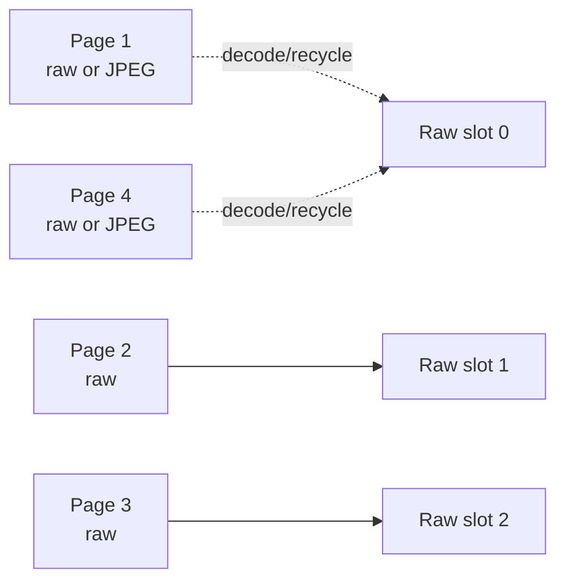
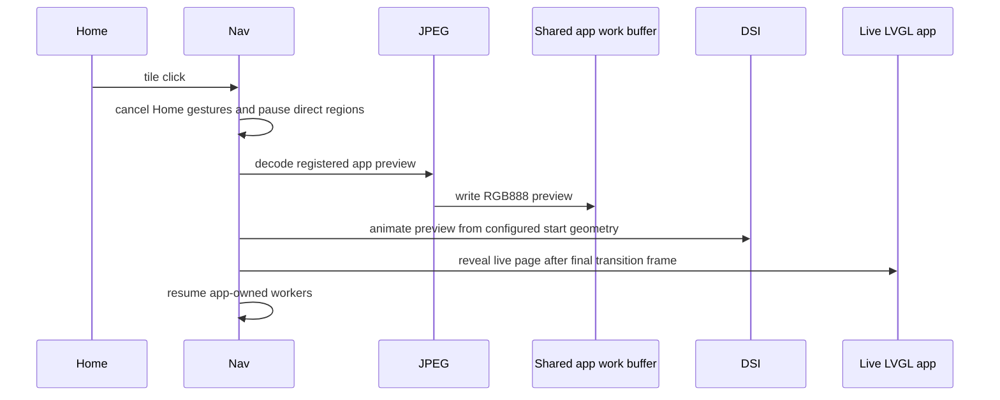
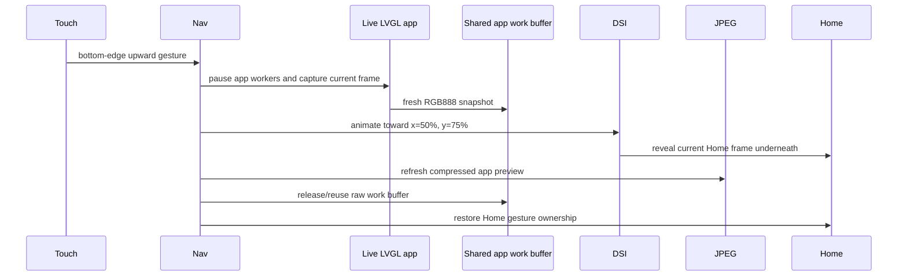
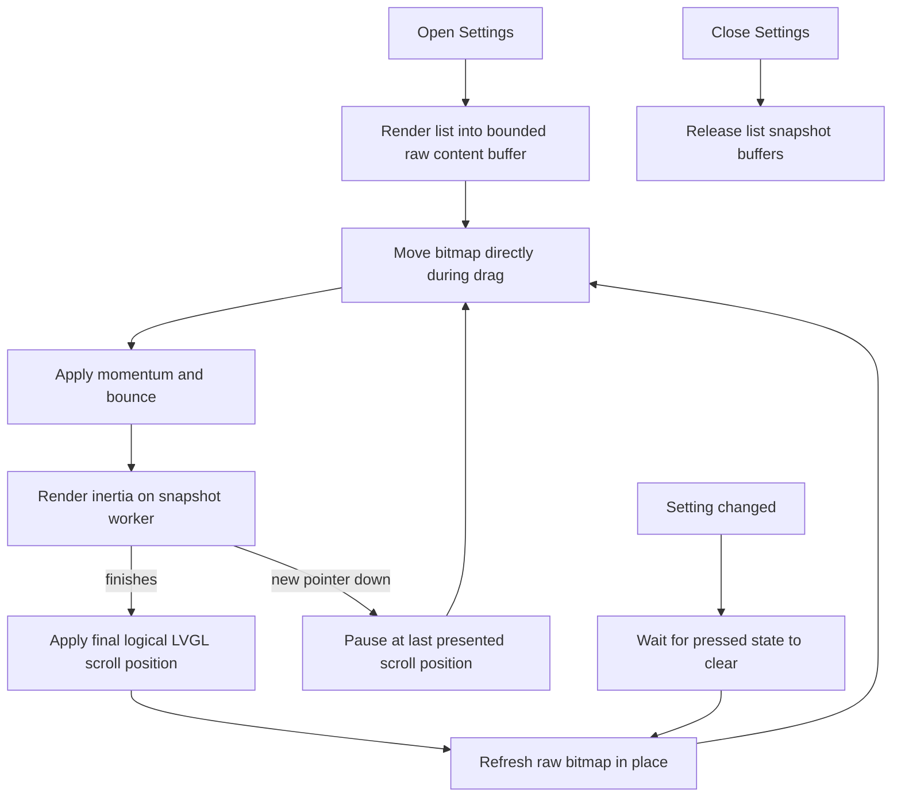

# Navigation and snapshot lifecycle

The navigation layer makes expensive motion independent of the complexity of
the live LVGL object tree. It owns gesture arbitration, Home paging,
application transitions, Settings scrolling, tap cancellation, and snapshot
lifetime.

## Declarative registration

The product declares navigation below `lvgl.navigation` in
`modules/lvgl/base.yaml`. The important collections are:

- `home.widgets`: ordered Home page roots;
- `home.indicators`: matching page indicators;
- `blockers`: overlays that temporarily prevent navigation;
- `applications`: app page/root pairs and lifecycle policy;
- `snapshot_compositor.scroll_regions`: lists that use snapshot scrolling.

A new object is not included because it happens to be visible. It must be
registered in the relevant collection.

## Gesture router

The gesture router observes one pointer stream and decides whether it is:

- a tap;
- a horizontal Home swipe;
- a vertical Settings scroll;
- a bottom-edge application close;
- a blocked interaction owned by an overlay.

Navigation-owned surfaces withhold the LVGL press until the pointer stream is
classified. This applies to Home and every registered snapshot scroll region.
A real tap is replayed as one short press/release pair, while a drag never
enters `LV_STATE_PRESSED`. This avoids accidental activation, delayed hover
after inertia, and a pressed-style redraw on the first movement sample. Other
surfaces keep the normal LVGL input path; for example, the top-layer clock can
still own its volume long-press.

Gesture classification, axis selection, release velocity, tap replay, and
in-flight takeover live in the shared navigation core. Motion backends remain
specialized: Home is a horizontal page window with commit/edge-settle policy,
while a scroll region is continuous vertical content with momentum and bounce.
Registering another list under `snapshot_compositor.scroll_regions` reuses the
same arbitration without copying Settings code.

Current product thresholds are:

| Gesture | Threshold |
| --- | --- |
| Home swipe start | First directional pixel |
| Home axis bias | 0 px |
| Home page commit | 25% of display width |
| App close edge | Bottom 50 px |
| App close commit | 36 px |
| Settings scroll start | First directional pixel |
| Settings axis bias | 1 px |

Thresholds are policy and may be tuned in YAML. The state machine and click
cancellation stay in the component.

## Home snapshot window

The Home screen currently contains four pages. Keeping all four raw at RGB888
would consume 7.68 MB. The runtime instead owns three fixed raw slots:

```text
3 * 800 * 800 * 3 = 5,760,000 bytes
```

The pages outside the window keep compressed JPEG backing.

| Current page | Raw window |
| --- | --- |
| Page 1 | Pages 1, 2, 3 |
| Page 2 | Pages 1, 2, 3 |
| Page 3 | Pages 2, 3, 4 |
| Page 4 | Pages 2, 3, 4 |



When the window moves:

1. A dirty page is JPEG-encoded before its slot is recycled.
2. A page already in the new window keeps its current raw slot.
3. The incoming page is decoded from JPEG into the released slot.
4. If no JPEG exists yet, it is created through an existing slot or the shared
   application work buffer.
5. The preallocated boot-time JPEG encoder output can be released after the
   initial cache is complete.

This is a bounded cache, not a growing panorama. Adding more Home pages does
not allocate another raw frame per page, but it increases compressed storage
and page preparation work.

## Home swipe lifecycle

```mermaid
sequenceDiagram
    participant Touch
    participant Nav as Gesture router
    participant Cache as Three-slot Home cache
    participant Comp as Direct snapshot compositor
    participant LVGL

    Touch->>Nav: pointer down; defer Home press
    Nav->>Nav: first directional pixel selects horizontal drag
    Nav->>LVGL: discard deferred press
    Nav->>Cache: request current and neighbor slots
    Nav->>Comp: begin direct movement
    loop pointer motion
        Touch->>Comp: absolute drag offset
        Comp->>Comp: PPA/DMA2D compose frame
    end
    Touch->>Nav: release
    Nav->>Comp: settle to committed page or bounce back
    opt pointer down while settle is active
        Nav->>Comp: pause worker on displayed frame
        Touch->>Comp: continue from the captured offset
        Comp->>Cache: rebase page pair at exact page boundary
    end
    Comp->>LVGL: apply final logical page
    Nav->>Cache: prepare the new three-page window
    Nav->>Comp: release manual ownership
```

The compositor starts on the first directional coordinate change. A pointer
down during settle pauses the worker at the last frame actually presented and
keeps manual framebuffer ownership. Dragging back reverses from that exact
offset. Continuing past the next page rebases the existing raw pair to the next
three-slot window at the page boundary; it does not expose LVGL or restart the
gesture from zero.

Settle duration scales with remaining distance and release velocity. Edge
return uses a separate smooth in/out curve and a 240-400 ms distance-dependent
duration, so the first and last page return more softly than a committed page
transition.

At the first and last page, the same compositor renders edge resistance and
bounce using the current snapshot rather than a nonexistent neighbor.

## Clock and page indicator

The clock and page indicator must look stable while page content moves. They
are drawn as a fixed overlay rather than being visually duplicated with every
page.

The direct snapshot path currently renders these elements into the composed
RGB888 output. The clock uses a persistent 64x64 A8 glyph buffer. Current
coordinates are product-specific and remain migration debt; a reusable
component must derive their geometry from configured widgets.

When an indicator or clock appears twice, shifts, or briefly shows the old
state, the usual cause is that both the snapshot and live LVGL layers own the
same pixels during handoff.

## Application lifecycle

Registered applications use the same controller. The reusable mechanism owns
transition timing and display handoff; YAML callbacks own application policy.

### Boot preparation

`lvgl.navigation.prepare_applications` renders each registered application and
stores compressed backing. Application previews do not remain as independent
raw 800x800 surfaces.

Applications can select their transition source independently for opening and
closing:

```yaml
applications:
  - id: immich_application
    page: immich_page
    widget: immich_root
    transition_snapshot:
      open: black
      close: live
```

`live` remains the default in both directions. The scalar forms
`transition_snapshot: live` and `transition_snapshot: black` remain compatible
and apply the same value to both directions. A black opening skips boot-time
capture. A black closing skips the close-time capture and refresh. The
compositor allocates one display-sized black draw buffer in the active LVGL
color format and shares it between every application that needs it. It does
not allocate one black frame per app.

Gallery and Camera use a black opening and a live closing. Opening from black
prevents a stale photo or video frame from appearing before the source has
restarted and shown its loader. Closing captures the current, fully presented
media frame, so the application shrinks back into Home instead of collapsing
as a black surface. Their transition geometry remains identical to normal
applications.

### Open



The raw preview is obtained on demand through one reusable full-screen work
buffer. The Home frame remains visible behind the opening transition.

Tile clicks are dispatched from inside `lv_timer_handler()`. The transition
worker must therefore be armed by the click handler but started only from the
next `LvglComponent::loop()` iteration, after that handler and its pending DSI
handoff have completed. Starting the worker directly in the click callback can
produce valid transition frames that are immediately covered by the native
LVGL flush which dispatched the click.

### Close



The closing animation uses a fresh raw image so it matches the app's current
state. Compression occurs after the visible close transition; the next open
uses that refreshed JPEG.

For a black close policy, the close path deliberately does not capture or
compress the live app. It binds the shared immutable black frame and leaves the
media owner free to stop its worker and release decoded content after the
navigation handoff.

For a live close policy on a direct full-screen producer, navigation first
pauses and drains that producer, then captures the exact DSI frame currently
presented by the panel. The close animation owns the resulting raw frame. Only
after capture may Camera or Gallery release its decoder, source, and motion
buffers. This is intentionally asymmetric with their black opening policy.

When the close source aliases a DSI framebuffer, encode the application preview
before `realign_direct_buffer_after_manual_present()` synchronizes the DSI pool.
Realignment copies the final Home frame to every display buffer; doing it first
would replace the application source and cache the same Home image for every
application.

The current direct transition applies a circular mask and assumes a square
display. The schema is reusable, but that implementation detail must be made
configurable before upstreaming it as display-agnostic behavior.

## Product lifecycle callbacks

Applications need different policy:

- Player pauses marquee and direct wave rendering during ownership handoff.
- Voice Assistant ends or preserves the conversation according to the close
  action, stops output when required, and disables AFE after the session.
- Settings allocates and releases its scroll snapshot.
- Immich freezes gallery presentation, hands off the current DSI frame, and
  releases decoded photos only when no worker references them.
- Camera drains its direct JPEG presentation session, hands the current frame
  to the close transition, then releases stream-owned fallback storage.

These callbacks are intentionally explicit. The goal is to move stable policy
into application controllers, not to hide unrelated cleanup inside the generic
navigation component.

Voice has one additional ownership invariant: wake words and tile taps must
both enter through `lvgl.navigation.open: voice_application`. Backend phases
describe the contents of the open application; they are not navigation events
and must never show the overlay directly. The presenter becomes active only
after `ui_active_app` identifies Voice, which keeps the direct waveform behind
the black application surface during handoff. Closing first raises the local
stop latch and then terminates the backend session, preventing delayed phase
callbacks from bringing Voice back after the close transition.

Regression tests for this contract must cover closing immediately after open,
before any speech, and keeping Home visible for several seconds after closing
during an active listening or replying session.

## Settings snapshot scrolling

Settings is a special scroll region. Redrawing the complete LVGL list on every
touch sample was slow, so the controller keeps a raw bitmap while Settings is
open.



Current policy:

- preload on app entry;
- maximum snapshot memory 8 MB;
- 15% overscroll;
- 560 ms momentum;
- 320 ms bounce;
- 900 ms maximum inertia;
- first directional pixel captures the drag; pointer-down without movement is
  replayed as a normal LVGL tap;
- pressed/hover state is never delivered to list children once the scroll owns
  the pointer stream;
- pointer-down during inertia pauses the worker at its last presented Y
  coordinate and lets the new drag continue from that exact frame;
- refresh in place after a setting change;
- release on app close.

If the list exceeds the configured cap, content may be split into bounded head
and tail segments. The controller must not allocate an unbounded full-page
surface.

The refreshed snapshot is delayed until pressed/hover state is gone. Capturing
earlier would bake a temporary state layer into the scroll bitmap.

The live Settings tree is deliberately hidden while its snapshot owns the
display. Gesture hit-testing therefore uses the registered root geometry even
when that source tree is hidden; requiring `lv_obj_is_visible()` would make an
in-flight snapshot impossible to interrupt.

## Generic store versus production cache

The public snapshot schema currently configures a generic
`LvglSnapshotStore` with bounded entries and decoded slots. The direct
production compositor also uses specialized cache functions in
`lvgl_esphome.cpp`:

- three raw Home slots plus JPEG backing;
- compressed application previews plus one shared work buffer;
- Settings raw content buffers for the application lifetime.

Therefore `compression: none` in the generic store must not be read as "the
product never uses JPEG snapshots." It describes the generic store policy,
while the specialized direct cache still uses hardware JPEG for off-window
Home pages and applications. Consolidating these implementations is an
explicit productization task.

## Snapshot invalidation

Mark a snapshot dirty when its visible content changes:

- a Home entity changes;
- a slider or switch changes;
- time or an indicator owned by the snapshot changes;
- application state changes before its next open;
- the Settings list changes.

Do not immediately rebuild every cache in the callback that changed the
widget. Coalesce updates, wait for transient pressed state to clear, then
refresh the smallest affected owner. Rebuilding while DSI, artwork decode, or
another snapshot operation is active increases PSRAM contention.

## Extension boundary

The following are automatic after registration:

- gesture classification and tap cancellation;
- Home commit/bounce behavior;
- application transition timing;
- display ownership handoff;
- Settings-style scroll mechanics.

The following still require explicit product configuration:

- page and indicator IDs;
- app page/root IDs;
- app lifecycle policy;
- snapshot invalidation triggers;
- direct worker pause/resume hooks;
- overlay blockers;
- whether an app close terminates an external session.

See [Extending the UI](../development/extending-ui.md) for concrete steps.

## Source map

Reusable implementation:

- `esphome/components/lvgl/lvgl_navigation.*`
- `esphome/components/lvgl/lvgl_direct_snapshot_compositor.*`
- `esphome/components/lvgl/lvgl_snapshot_store.*`
- `esphome/components/lvgl/snapshot/`
- `esphome/components/lvgl/lvgl_esphome.cpp`

Product configuration:

- `modules/lvgl/base.yaml`
- `modules/lvgl/navigation.yaml`
- `modules/lvgl/pages/`

