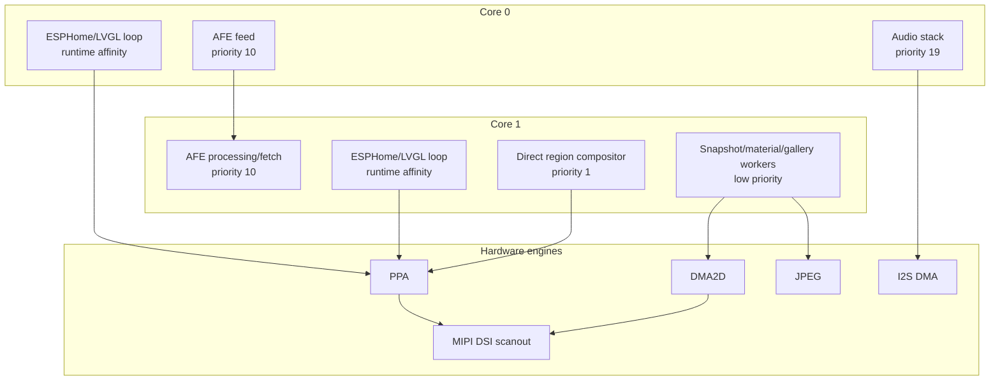

# Runtime tasks and memory

The ESP32-P4 has enough PSRAM for this interface, but bandwidth and contiguous
blocks are finite. Performance depends more on ownership and transfer timing
than on the raw percentage of free CPU.

## Scheduling model

This diagram shows the intended separation, not a promise that every task is
permanently pinned. The display scanout and accelerators run in hardware.
Auxiliary composition is moved off the LVGL loop where practical. Some workers
are deliberately unpinned so FreeRTOS can avoid a temporarily busy core.

## Priority policy

Priority expresses deadline sensitivity:

1. WiFi and hardware/audio deadlines.
2. Audio transport and AFE.
3. Realtime voice playback and microphone delivery.
4. ESPHome main loop and LVGL.
5. Visual worker tasks.

Visual animation frames may be coalesced or dropped. Audio frames, DSI
ownership transitions, and cache barriers may not.

Do not increase a visual worker priority to make an animation look smoother
without measuring audio, WiFi, and DSI effects. A lower reported CPU
percentage does not imply unused capacity if the workload is blocked on PSRAM,
cache synchronization, or a hardware queue.

## Persistent full-screen memory

At 800x800 RGB888:

| Owner | Count | Bytes each | Total |
| --- | ---: | ---: | ---: |
| MIPI DSI driver | 3 | 1,920,000 | 5,760,000 bytes (5.49 MiB) |
| Home raw snapshot window | 3 | 1,920,000 | 5,760,000 bytes (5.49 MiB) |
| Shared black application transition | 1 | 1,920,000 | 1,920,000 bytes (1.83 MiB) |

These allocations have different owners and cannot be merged:

- DSI buffers are the display scanout/render pool.
- Home slots are reusable source images used to compose neighboring pages.
- The black application frame is immutable and shared by Gallery and Camera;
  it replaces their volatile open/close captures and is never duplicated per
  application.

They are the largest persistent graphics consumers. Adding a Home page does
not add another raw slot; it adds compressed backing and cache work.

## Dynamic large allocations

| Allocation | Approximate size | Lifetime |
| --- | ---: | --- |
| Shared application RGB888 work buffer | 1,920,000 bytes | Decode/open/close work; reused across apps |
| Decoded 800x800 artwork or gallery image | 1,920,000 bytes | Current image lease |
| Gallery encoded JPEG buffer | 786,432 bytes configured | Gallery app/download lifetime |
| Camera encoded JPEG buffer | 786,432 bytes configured | Component lifetime |
| Camera decoded RGB888 frame | Source dimensions x 3; 1,920,000 bytes at 800x800 | Camera app lifetime |
| Settings raw scroll content | Up to 8 MiB configured | Only while Settings is open |
| Boot Lottie raster frame cache | About 11 MiB for current asset | Boot animation only; released before normal UI |
| Wavy progress ARGB buffers | About 714 KiB for three 244x244 buffers | Player direct widget lifetime |
| Wavy progress RGB565 backdrops | About 349 KiB for three 244x244 crops | Player direct widget lifetime; active/in-flight/next ownership |
| Realtime voice playback and uplink rings | Bounded PSRAM buffers | Component lifetime |
| SendSpin source buffer | 600,000 bytes | Component lifetime |

Sizes are architectural budgets, not a complete heap report. ESP-IDF, WiFi,
LVGL objects, fonts, image descriptors, stacks, queues, and codec libraries
also consume memory.

## Phase model

The same large features must not all peak simultaneously.

| Phase | Expected large owners |
| --- | --- |
| Early boot | DSI buffers, Lottie scene/cache, audio setup |
| Boot cache preparation | DSI buffers, Lottie final frame, Home slots, JPEG encoder work |
| Home idle | DSI buffers, Home slots, compressed app/Home backing |
| Music playback | Home/DSI buffers, current artwork, direct media buffers, SendSpin/audio rings |
| Settings | Home/DSI buffers, Settings raw scroll content; app preview work released after handoff |
| Voice session | Home/DSI buffers, voice rings, AFE buffers, Assistant UI direct regions |
| Gallery | Home/DSI buffers, current decoded photo, encoded download/prefetch buffer, transition scratch when needed |
| Camera | Home/DSI buffers, encoded MJPEG input, one current decoded frame; no frame queue |

The boot sequence releases the Lottie frame cache before normal application
caches and network artwork can create their own peak. Changing this order can
produce allocation failures even when total free PSRAM appears sufficient.

## Allocation policy

### Allocate once

Use persistent bounded allocation for:

- display buffers;
- Home raw slots;
- direct-widget frame buffers;
- audio rings and task stacks;
- request queues and DMA descriptors.

### Lease and reuse

Use explicit leases for:

- current artwork/gallery decoded data;
- application raw work buffer;
- decoded snapshot slot;
- transition scratch.

The producer may overwrite a lease only after the display and every worker have
released it.

### Compress when inactive

JPEG is appropriate for:

- off-window Home pages;
- inactive application previews;
- network/download storage before hardware decode.

JPEG is not useful for a frame currently being scanned or transformed. It must
be decoded to pixels before DSI or PPA can consume it.

## PSRAM bandwidth

The panel continuously reads display data. Other major PSRAM users include:

- JPEG output writes;
- PPA and DMA2D source/destination traffic;
- copying a stale direct-region base;
- Settings bitmap movement;
- Home slot decode/recycle;
- audio and voice rings;
- Lottie frame fetch.

The fastest individual transfer is not always the fastest system behavior.
A single maximum-burst operation can temporarily starve DSI. Conversely,
globally lowering every burst can destroy UI frame rate.

Use these rules:

1. Eliminate duplicate reads/writes before throttling.
2. Decode directly into the final reusable destination where ownership permits.
3. Synchronize only changed ranges.
4. Queue snapshot, JPEG, and artwork operations so large transfers do not
   overlap.
5. Apply conservative burst settings to the offending engine, not globally.
6. Keep DSI scanout and audio deadlines above best-effort visual work.

## Direct-widget memory

The 244x244 wavy media control illustrates the intended direct-render pattern:

- front, worker, and spare ARGB8888 buffers;
- three RGB565 backdrop crops for active, in-flight, and next artwork;
- precomputed geometric tables;
- one low-priority raster worker;
- one direct-region presentation path;
- coalesced state updates while the worker is busy.

The local buffers are much smaller than a full screen. Triple ARGB buffers let
one wave frame be displayed while another is produced; triple RGB565 crops let
artwork change without modifying memory still owned by PPA. They do not replace
the three DSI buffers.

Direct marquee and volume controls use the same principle: render only their
bounded region, submit it over a generation-tagged base, and pause at
navigation handoff.

## Lottie memory explanation

A Lottie file stores vector instructions compactly, but the display cannot
scan JSON or vector paths. Runtime stages include:

- parsed scene graph;
- geometry and paint state;
- raster working surface;
- conversion/presentation surface;
- optional cached raster frames.

The optional frame cache dominates memory because it trades PSRAM for stable
playback. This is why a small JSON can consume megabytes at runtime.

## Gallery memory rules

The Immich path uses hardware JPEG and a reusable decoded allocation:

1. download compressed bytes into the bounded encoded buffer;
2. freeze direct pan before replacing the decoded source;
3. decode directly into a leased RGB888 destination;
4. publish the new source only after decode and cache synchronization;
5. pin the old visible frame in the DSI pool during transition;
6. reuse or release the old decoded allocation after handoff.

The current pan-only configuration uses `zoom_start = zoom_end = 1.0`, a
roughly 34 ms frame interval, and a movement duration derived from the user
configured slideshow interval (30 seconds by default) minus the 1.2-second
transition lead. PPA SRM does the image movement; the CPU computes geometry and
schedules frames.

Showing the gallery controls allocates one transient 800x800 RGB888 surface
(1,920,000 bytes, or 1.92 MB) containing the exact DSI frame at the pause
point. It exists only while the HUD is visible and is released when motion
resumes or the app closes.
The encoded next image remains prefetched as JPEG and is hardware-decoded only
when the transition scheduler requests it.

The full-screen direct volume overlay reuses that exact Gallery surface as its
immutable original. It adds one 1,920,000-byte dimmed background and a banded
scratch surface of about 154 KiB; it does not allocate a second original. The
moving-Gallery peak attributable to freeze plus volume is therefore about
4.0 MB instead of the previous roughly 6.9 MB. The old path simultaneously
held the Gallery capture, overlay original, overlay background, and a
1.15 MB scratch surface. A Gallery already paused for its controls retains and
lends the same exact capture, so its peak is also about 4.0 MB. On screens with
no lending direct scene, the overlay instead owns one original, one background,
and the same small scratch. Scratch rendering is split into 64-row bands so no
display-sized temporary image is needed. Borrowed memory remains Gallery-owned
and is released only after the overlay restores its frame and Gallery resumes.
The overlay also holds the existing LVGL/DSI framebuffer presentation session
for the gesture. Session ownership adds no framebuffer allocation; it pauses
competing refresh and presentation work so the dimmed background remains the
base for all banded updates.

The clock is the activation target but is never part of the visible volume
overlay. Native screens remove it by rendering only its bounded rectangle from
the complete display stack after the widget is hidden. A suspended direct
scene can lend a frame in which the clock was already painted, so it also
temporarily exposes its clean source and current crop for that off-screen patch
render. Gallery reconstructs only the clock-sized photo region from the active
slideshow source; the captured full frame remains immutable and visible until
the overlay begins. This adds no display-sized buffer and prevents the clock
from reappearing over Gallery, Camera, or future direct-render applications.

Application close first captures the exact visible frame for the close
animation. The slideshow source is detached and all transient motion surfaces
are then released before the reusable decoded photo lease is returned. The
closed gallery retains no decoded previous photo, so reopening starts on the
black loader rather than a stale PSRAM pointer.

## Camera memory rules

The camera path always keeps one bounded encoded JPEG buffer. Native-size JPEG
is decoded directly into a leased DSI frame, so this path owns no decoded video
bitmap and never queues decoded frames. Non-native geometry may allocate one
reusable decoded RGB fallback. If JPEG hardware or the direct presenter still
owns a destination, the incoming frame is dropped and the last complete DSI
frame stays visible. Closing the camera application releases the fallback
while retaining the smaller encoded input buffer to avoid PSRAM fragmentation.

A controlled native 800x800 stream sustained 10 FPS with zero frame drops,
about 40 ms hardware decode time and 13.6 ms presentation time. The camera
component returned to about 750 KiB after close. See
[Camera streaming](camera-streaming.md) for the complete ownership and
server-normalization contract.

## Measuring memory

Every memory report should include:

- internal heap free and largest block;
- PSRAM free and largest block;
- DSI framebuffer addresses and count;
- Home raw slot count;
- application work-buffer state;
- current decoded artwork/gallery lease;
- Settings snapshot bytes;
- Lottie frame-cache bytes;
- audio and realtime ring occupancy;
- phase name.

Free bytes alone are insufficient. A 1.92 MiB image allocation fails when the
largest contiguous block is smaller even if the sum of free fragments is
larger.

## Known performance checkpoint

The validated integration checkpoint has demonstrated:

- three 1,920,000-byte DSI buffers aligned to 128 bytes;
- approximately 57-59 FPS for synthetic Home swipe;
- approximately 59 FPS for Settings snapshot scroll;
- no reported DSI underrun in the corresponding test;
- DSI FIFO minimum around 895 in that run.

These are comparison points, not guarantees for every screen. Re-run the same
scenario after changes to burst length, cache synchronization, buffer count,
image decode, or task placement.

## Source map

- `esphome/components/mipi_dsi/`
- `esphome/components/lvgl/lvgl_esphome.*`
- `esphome/components/lvgl/lvgl_direct_snapshot_compositor.*`
- `esphome/components/lvgl_material/`
- `esphome/components/esp32_jpeg/`
- `esphome/components/esp_audio_stack/`
- `esphome/components/esp_afe/`
- `pipecat-homeassistant/components/va_pipecat/`
- `modules/lvgl/base.yaml`
- `modules/hardware/audio.yaml`
- `modules/player/artwork.yaml`
- `modules/immich/`
- `modules/camera/`

