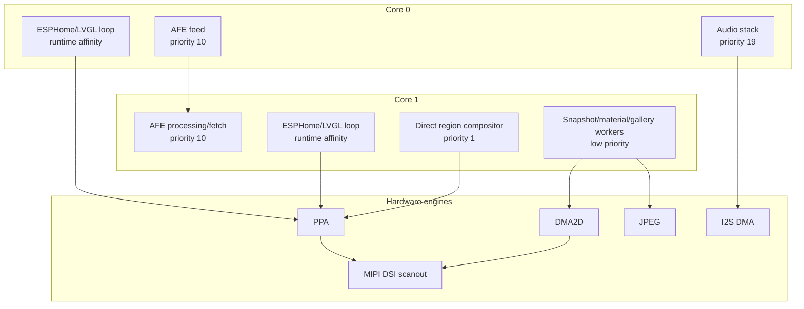

# Runtime tasks and memory

The ESP32-P4 has enough PSRAM for this interface, but bandwidth and contiguous
blocks are finite. Performance depends more on ownership and transfer timing
than on the raw percentage of free CPU.

## Scheduling model

```mermaid
flowchart TB
    subgraph CORE0["Core 0"]
        AUDIO["Audio stack<br/>priority 19"]
        AFE_FEED["AFE feed<br/>priority 10"]
        MAIN0["ESPHome/LVGL loop<br/>runtime affinity"]
    end

    subgraph CORE1["Core 1"]
        AFE["AFE processing/fetch<br/>priority 10"]
        REGION["Direct region compositor<br/>priority 1"]
        WORKERS["Snapshot/material/gallery workers<br/>low priority"]
        MAIN1["ESPHome/LVGL loop<br/>runtime affinity"]
    end

    subgraph HW["Hardware engines"]
        DSI["MIPI DSI scanout"]
        DMA2D["DMA2D"]
        PPA["PPA"]
        JPEG["JPEG"]
        I2S["I2S DMA"]
    end

    AUDIO --> I2S
    AFE_FEED --> AFE
    MAIN0 --> PPA
    MAIN1 --> PPA
    REGION --> PPA
    WORKERS --> DMA2D
    WORKERS --> JPEG
    PPA --> DSI
    DMA2D --> DSI
```

This diagram shows the intended separation, not a promise that every task is
permanently pinned. The display scanout and accelerators run in hardware.
Auxiliary composition is moved off the LVGL loop where practical. Some workers
are deliberately unpinned so FreeRTOS can avoid a temporarily busy core.

## Priority policy

Priority expresses deadline sensitivity:

1. WiFi and hardware/audio deadlines.
2. Audio transport and AFE.
3. Realtime voice playback and microphone delivery.
4. ESPHome main loop and LVGL.
5. Visual worker tasks.

Visual animation frames may be coalesced or dropped. Audio frames, DSI
ownership transitions, and cache barriers may not.

Do not increase a visual worker priority to make an animation look smoother
without measuring audio, WiFi, and DSI effects. A lower reported CPU
percentage does not imply unused capacity if the workload is blocked on PSRAM,
cache synchronization, or a hardware queue.

## Persistent full-screen memory

At 800x800 RGB888:

| Owner | Count | Bytes each | Total |
| --- | ---: | ---: | ---: |
| MIPI DSI driver | 3 | 1,920,000 | 5,760,000 bytes (5.49 MiB) |
| Home raw snapshot window | 3 | 1,920,000 | 5,760,000 bytes (5.49 MiB) |
| Shared black application transition | 1 | 1,920,000 | 1,920,000 bytes (1.83 MiB) |

These allocations have different owners and cannot be merged:

- DSI buffers are the display scanout/render pool.
- Home slots are reusable source images used to compose neighboring pages.
- The black application frame is immutable and shared by Gallery and Camera;
  it replaces their volatile open/close captures and is never duplicated per
  application.

They are the largest persistent graphics consumers. Adding a Home page does
not add another raw slot; it adds compressed backing and cache work.

## Dynamic large allocations

| Allocation | Approximate size | Lifetime |
| --- | ---: | --- |
| Shared application RGB888 work buffer | 1,920,000 bytes | Decode/open/close work; reused across apps |
| Player decoded RGB565 artwork | 1,280,000 bytes at 800x800 | Retained across Player closes and reused by the next open |
| Gallery/Settings contiguous work allocation | About 3 MiB, or the exact current Settings snapshot requirement | Allocated on application entry, exclusively leased while needed, released on close; not reserved during boot |
| Gallery encoded JPEG buffer | 786,432 bytes configured | Gallery app/download lifetime |
| Camera encoded JPEG buffer | 786,432 bytes configured | Component lifetime |
| Camera decoded RGB888 frame | Source dimensions x 3; 1,920,000 bytes at 800x800 | Camera app lifetime |
| Boot Lottie raster frame cache | About 11 MiB for current asset | Boot animation only; released before normal UI |
| Wavy progress ARGB buffers | About 714 KiB for three 244x244 buffers | Player direct widget lifetime |
| Wavy progress RGB565 backdrops | About 349 KiB for three 244x244 crops | Player direct widget lifetime; active/in-flight/next ownership |
| Realtime voice playback and uplink rings | Bounded PSRAM buffers | Component lifetime |
| SendSpin source buffer | 600,000 bytes | Component lifetime |

Sizes are architectural budgets, not a complete heap report. ESP-IDF, WiFi,
LVGL objects, fonts, image descriptors, stacks, queues, and codec libraries
also consume memory.

## Phase model

The same large features must not all peak simultaneously.

| Phase | Expected large owners |
| --- | --- |
| Early boot | DSI buffers, Lottie scene/cache, audio setup |
| Boot cache preparation | DSI buffers, Lottie final frame, Home slots, JPEG encoder work |
| Home idle | DSI buffers, Home slots, compressed app/Home backing, selected weather canvas; no idle application arena reservation |
| Music playback | Home/DSI buffers, current artwork, direct media buffers, SendSpin/audio rings |
| Settings | Home/DSI buffers, shared arena lent as the Settings raw scroll bitmap; app preview work released after handoff |
| Voice session | Home/DSI buffers, voice rings, AFE buffers, Assistant UI direct regions |
| Gallery | Home/DSI buffers, shared arena used as the full-resolution RGB565 photo destination, encoded download/prefetch buffer, transition scratch when needed |
| Camera | Home/DSI buffers, encoded MJPEG input, one current decoded frame; no frame queue |

The boot sequence releases the Lottie frame cache before normal application
caches and network artwork can create their own peak. Changing this order can
produce allocation failures even when total free PSRAM appears sufficient.

### Historical boot-arena policy (superseded 2026-09-19)

The following describes the earlier fragmentation mitigation, not the current
boot policy. See "2026-09-19 allocation lifecycle correction" below.

Gallery and Settings used one deterministic contiguous arena because the two
applications are mutually exclusive. Gallery's padded 1632x912 RGB565
hardware-JPEG destination requires 2,976,768 bytes. The current Settings tree
requires a 3,213,600-byte RGB888 scroll bitmap, so boot reserves the larger
requirement as a 3,213,632-byte aligned decoder spare after the Lottie cache is
released and before normal application activity can fragment PSRAM. Opening
Settings loans that exact pointer to the snapshot-scroll controller; capture
writes directly into it. Closing Settings returns the same pointer to the
Gallery decoder pool without `free()` or `malloc()`. Closing Gallery similarly
retires the active photo into the reusable spare and releases only stale pinned
generations and transition workspaces. Player independently keeps its two
800x800 decoded artwork destinations across closes. Compressed inputs remain
bounded and independent.

This fixed cost is intentional. The former Settings path freed Gallery's block,
allocated its larger scroll bitmap, then tried to allocate Gallery again on
close. That sequence fragmented PSRAM and failed with enough total free memory
but a largest block below 2,976,768 bytes. The lease avoids both fragmentation
and a second display-sized copy. Total free memory is not proof that a
full-resolution hardware-JPEG destination can still be allocated.

## Allocation policy

### Allocate once

Use persistent bounded allocation for:

- display buffers;
- Home raw slots;
- direct-widget frame buffers;
- audio rings and task stacks;
- request queues and DMA descriptors.

### Lease and reuse

Use explicit leases for:

- current artwork/gallery decoded data;
- application raw work buffer;
- decoded snapshot slot;
- transition scratch.

The producer may overwrite a lease only after the display and every worker have
released it.

### Compress when inactive

JPEG is appropriate for:

- off-window Home pages;
- inactive application previews;
- network/download storage before hardware decode.

JPEG is not useful for a frame currently being scanned or transformed. It must
be decoded to pixels before DSI or PPA can consume it.

## Image concurrency mechanisms and current status

These terms describe separate mechanisms. They must not be used as a generic
claim that image work is already centrally scheduled.

| Mechanism | Concrete behavior | Current implementation |
| --- | --- | --- |
| Request priority | A visible replacement is allowed to cancel or postpone a hidden prefetch before either job acquires JPEG, PPA, or a large destination lease. This is a job-ordering rule, not merely a higher FreeRTOS task priority. | Component-local ordering exists. There is no generic cross-component image scheduler yet. |
| Generation rejection | Every published source has an increasing generation. A worker records the requested generation and drops its result before presentation when a newer generation already exists. | Implemented by `ImageFrameSource`/`lvgl_image_presenter`; artwork also coalesces pending SendSpin work. It does not cancel every byte of an already running hardware transaction. |
| Reusable buffer pool | Encoded input, active decoded output, decode staging, and a bounded spare are retained and leased instead of allocating and freeing a full image for each URL. A retired buffer is released only after no renderer can reference it. | Implemented locally by `artwork_image`. Settings explicitly borrows Gallery's idle contiguous spare; Camera remains independent because it can overlap other applications and has different frame ownership. |
| Shared modal workspace | Mutually exclusive applications borrow one 800x800 RGB888 work surface for snapshot decode/open/close work. Its owner identity is changed only after the previous use completes. | Implemented as the shared application snapshot work buffer. Gallery/artwork/camera still own feature-specific decode and transition allocations. |
| Adaptive FPS/quality | Measured deadline misses would reduce background prefetch cadence or transition frame count while retaining 800x800 source quality; after recovery the cadence would rise again. | Not implemented as a generic policy. Current presenters use fixed frame intervals plus request coalescing. |

The missing generic scheduler is not automatically the next optimization. It
should be introduced only when measurements show two independent image owners
actually overlap. A central queue that serializes unrelated small operations
would increase latency without reducing PSRAM traffic.

## PSRAM bandwidth

The panel continuously reads display data. Other major PSRAM users include:

- JPEG output writes;
- PPA and DMA2D source/destination traffic;
- copying a stale direct-region base;
- Settings bitmap movement;
- Home slot decode/recycle;
- audio and voice rings;
- Lottie frame fetch.

The fastest individual transfer is not always the fastest system behavior.
A single maximum-burst operation can temporarily starve DSI. Conversely,
globally lowering every burst can destroy UI frame rate.

Use these rules:

1. Eliminate duplicate reads/writes before throttling.
2. Decode directly into the final reusable destination where ownership permits.
3. Synchronize only changed ranges.
4. Queue snapshot, JPEG, and artwork operations so large transfers do not
   overlap.
5. Apply conservative burst settings to the offending engine, not globally.
6. Keep DSI scanout and audio deadlines above best-effort visual work.

## Direct-widget memory

The 244x244 wavy media control illustrates the intended direct-render pattern:

- front, worker, and spare ARGB8888 buffers;
- three RGB565 backdrop crops for active, in-flight, and next artwork;
- precomputed geometric tables;
- one low-priority raster worker;
- one direct-region presentation path;
- coalesced state updates while the worker is busy.

The local buffers are much smaller than a full screen. Triple ARGB buffers let
one wave frame be displayed while another is produced; triple RGB565 crops let
artwork change without modifying memory still owned by PPA. They do not replace
the three DSI buffers.

Direct marquee and volume controls use the same principle: render only their
bounded region, submit it over a generation-tagged base, and pause at
navigation handoff.

## Lottie memory explanation

A Lottie file stores vector instructions compactly, but the display cannot
scan JSON or vector paths. Runtime stages include:

- parsed scene graph;
- geometry and paint state;
- raster working surface;
- conversion/presentation surface;
- optional cached raster frames.

The optional frame cache dominates memory because it trades PSRAM for stable
playback. This is why a small JSON can consume megabytes at runtime.

## Gallery and Settings shared-arena rules

The Immich path uses hardware JPEG and one boot-reserved decoded allocation:

1. download compressed bytes into the bounded encoded buffer;
2. freeze direct pan before replacing the decoded source;
3. decode the full-resolution image directly into a padded RGB565 destination;
4. publish the new source only after decode and cache synchronization;
5. use PPA SRM to crop and convert RGB565 into the RGB888 DSI target for each
   visible pan frame;
6. reuse the allocation for the next image; when Gallery closes, preserve that
   exact block as the decoder spare while releasing stale generations and
   transition scratch.

Settings never allocates a competing display-sized bitmap. Before opening it
releases Gallery's active decoded generation into the spare pool, loans the
smallest spare large enough for the measured Settings content, and gives that
pointer to `snapshot_scroll`. The controller captures directly into the loaned
RGB888 memory and marks it externally owned. On close it drains scrolling,
detaches the pointer, and returns it to `artwork_image`. A fallback allocation
is permitted only when no suitable external buffer was supplied; the product
configuration treats that fallback as a diagnostic failure.

The current pan-only configuration uses `zoom_start = zoom_end = 1.0`, a
roughly 34 ms frame interval, and a movement duration derived from the user
configured slideshow interval (30 seconds by default) minus the 1.2-second
transition lead. PPA SRM does the image movement; the CPU computes geometry and
schedules frames.

Showing the gallery controls allocates one transient 800x800 RGB888 surface
(1,920,000 bytes, or 1.92 MB) containing the exact DSI frame at the pause
point. It exists only while the HUD is visible and is released when motion
resumes or the app closes.
The encoded next image remains prefetched as JPEG and is hardware-decoded only
when the transition scheduler requests it.

On the current 1620x911 source, padded to 1632x912, the measured pan path
delivers 28-29 FPS. A frame costs 33.4-35.2 ms on average, of which
33.3-34.9 ms is PPA SRM; no frames failed during the measured run. Reducing the
34 ms timer cannot increase throughput because conversion already consumes the
frame budget. A faster RGB888-source path would need a shared contiguous arena
of about 4.46 MB that can be borrowed safely while Gallery is open. It must not
be implemented by lowering source resolution or by retaining another permanent
full-screen allocation.

The full-screen direct volume overlay reuses that exact Gallery surface as its
immutable original. It adds one 1,920,000-byte dimmed background and a banded
scratch surface of about 154 KiB; it does not allocate a second original. The
moving-Gallery peak attributable to freeze plus volume is therefore about
4.0 MB instead of the previous roughly 6.9 MB. The old path simultaneously
held the Gallery capture, overlay original, overlay background, and a
1.15 MB scratch surface. A Gallery already paused for its controls retains and
lends the same exact capture, so its peak is also about 4.0 MB. On screens with
no lending direct scene, the overlay instead owns one original, one background,
and the same small scratch. Scratch rendering is split into 64-row bands so no
display-sized temporary image is needed. Borrowed memory remains Gallery-owned
and is released only after the overlay restores its frame and Gallery resumes.
The overlay also holds the existing LVGL/DSI framebuffer presentation session
for the gesture. Session ownership adds no framebuffer allocation; it pauses
competing refresh and presentation work so the dimmed background remains the
base for all banded updates.

The clock is the activation target but is never part of the visible volume
overlay. Native screens remove it by rendering only its bounded rectangle from
the complete display stack after the widget is hidden. A suspended direct
scene can lend a frame in which the clock was already painted, so it also
temporarily exposes its clean source and current crop for that off-screen patch
render. Gallery reconstructs only the clock-sized photo region from the active
slideshow source; the captured full frame remains immutable and visible until
the overlay begins. This adds no display-sized buffer and prevents the clock
from reappearing over Gallery, Camera, or future direct-render applications.

Application close first captures the exact visible frame for the close
animation. The slideshow source is detached and all transient motion surfaces
are then released before the reusable decoded photo lease is returned. The
closed gallery retains no decoded previous photo, so reopening starts on the
black loader rather than a stale PSRAM pointer.

## Camera memory rules

The camera path always keeps one bounded encoded JPEG buffer. Native-size JPEG
is decoded directly into a leased DSI frame, so this path owns no decoded video
bitmap and never queues decoded frames. Non-native geometry may allocate one
reusable decoded RGB fallback. If JPEG hardware or the direct presenter still
owns a destination, the incoming frame is dropped and the last complete DSI
frame stays visible. Closing the camera application releases the fallback
while retaining the smaller encoded input buffer to avoid PSRAM fragmentation.

A controlled native 800x800 stream sustained 10 FPS with zero frame drops,
about 40 ms hardware decode time and 13.6 ms presentation time. The camera
component returned to about 750 KiB after close. See
[Camera streaming](camera-streaming.md) for the complete ownership and
server-normalization contract.

## Measuring memory

Every memory report should include:

- internal heap free and largest block;
- PSRAM free and largest block;
- DSI framebuffer addresses and count;
- Home raw slot count;
- application work-buffer state;
- current decoded artwork/gallery lease;
- Settings snapshot bytes;
- Lottie frame-cache bytes;
- audio and realtime ring occupancy;
- phase name.

Free bytes alone are insufficient. A 1.92 MiB image allocation fails when the
largest contiguous block is smaller even if the sum of free fragments is
larger.

## Known performance checkpoint

The validated integration checkpoint has demonstrated:

- three 1,920,000-byte DSI buffers aligned to 128 bytes;
- approximately 57-59 FPS for synthetic Home swipe;
- approximately 59 FPS for Settings snapshot scroll;
- no reported DSI underrun in the corresponding test;
- DSI FIFO minimum around 895 in that run.

These are comparison points, not guarantees for every screen. Re-run the same
scenario after changes to burst length, cache synchronization, buffer count,
image decode, or task placement.

The final paced 2026-08-10 Camera -> Player -> Gallery -> Home lifecycle test
added a second product checkpoint:

- Camera presented roughly 12.5 FPS from the public aquarium source and retained
  about 750 KiB after close;
- Player had no hidden Lottie allocation (`memory.lottie total=0K`);
- Gallery pan sustained about 28-29 FPS with hardware JPEG and PPA SRM;
- Home carousel sustained 45-48 FPS immediately after the complete flow, with
  about 18.2-19.0 ms average compositor time;
- Home idle finished with about 6.0 MiB free PSRAM and a 3.2 MiB largest block;
- no application work buffer, decoded Camera fallback, or Gallery motion
  surface remained owned after close;
- no DSI underrun was reported and the observed FIFO minimum remained around
  895.

The 2026-08-16 shared-arena hardware test added a fragmentation checkpoint:

- boot reserved one 3,213,632-byte Gallery/Settings arena;
- Settings captured 3,213,600 bytes directly into the loaned pointer and
  scrolled at 57 FPS over 79 frames, averaging 16.9 ms with no failed frame;
- closing Settings returned the same pointer, and Gallery then hardware-decoded
  512x911 and 1620x911 images successfully;
- a second Settings open reused the same pointer without allocation failure;
- Camera presented about 14 FPS and the volume overlay completed 42 requested
  updates as 20 coalesced renders;
- no reset, heap corruption, allocation failure, DSI underrun, bridge underrun,
  host underrun, or zero FIFO sample was reported during the sequence.

These values prove that the three applications release their transient owners;
they do not imply that network first-frame latency or application-open scaling
is already optimal.

## 2026-09-15 DSI lease checkpoint

The boot snapshot preparation was corrected so the reusable DSI framebuffer
used as an application-transition source is released before Home becomes
active. The source lease is now held only for an opening or closing animation
and is released on completion or cancellation. A full COM5 flash and runtime
smoke test showed:

- no `DIRECT frame boundary timed out` messages after boot preparation;
- application open/close traces with `rejected=0` for Settings and Player;
- DSI stress counters `brg_under=0`, `host_under=0`, and `fifo_zero=0`;
- the Settings close returned the shared pool with `7948 KiB` PSRAM free and
  a `3712 KiB` largest block in the tested run.

The remaining `dsi frame late` and `direct regions: failed to rebase` messages
are separate latency/region diagnostics. They must not be reported as DSI
underruns without a non-zero bridge, host, or FIFO counter.

### 2026-09-19 allocation lifecycle correction

Do not reserve Gallery/Settings and Player decode pools during boot. Together
they can prevent the selected weather region from allocating its 442,368-byte
clean background. The observed symptom was repeated `background-allocation`
publication failures, not slow ThorVG rasterization.

Settings reserves its exact required scroll capacity on entry, loans it to the
snapshot compositor, then returns and releases it on close. Player reserves
its two cover generations when opened. Gallery does not reserve an 800x800
decode spare: originals can be larger, and that unusable spare fragments the
heap before the JPEG SOF-sized allocation. A tested 1620x911 source requires
2,976,768 bytes after hardware alignment. Never lower source resolution to
hide this allocation failure.

Gallery temporarily reduces the Home raw window to the current page after its
opening transition completes. The other two pages keep JPEG backing, returning
3,840,000 bytes to PSRAM without discarding the current Player cover. The retained
raw Home page remains the closing animation's background. After the Gallery
close callback releases the photo buffers, the compositor refills the two
missing slots before returning to ordinary navigation. Refilling must preserve
the retained slot, including on allocation failure. Other applications keep
the allocation-free, three-slot close path.

Earlier boot-arena measurements above are historical checkpoints, not the
current allocation policy.

Sleeping Home refreshes one data page per 15-second interval. Resident pages
are rendered into their existing raw slot and encoded to JPEG. For an
off-window page, if the shared application workspace is absent, the refresh
temporarily borrows one resident slot, first ensuring its current JPEG is
valid. It renders and encodes the requested page, then decodes the original
resident page back into the same slot. The busy flag prevents concurrent
reuse. A failed restore clears the slot's page identity rather than exposing
the temporary page as the original. No fourth raw Home bitmap is allocated.

Camera's HTTP read scratch prefers PSRAM: `esp_http_client_read()` copies into
it, so this memory does not require internal/DMA capabilities. The bounded
network/driver allocations still use their existing internal-memory policy.
Camera and Gallery M3 loaders stop and free their task/pixel resources after
loading instead of keeping two paused render workers. Mixed-app validation
must track internal heap separately; several MiB of free PSRAM cannot satisfy
an internal-only socket/driver allocation.

The Voice waveform, Player waveform and marquee worker stacks prefer PSRAM
(6 KiB, 8 KiB and 6 KiB respectively). They are ordinary render tasks, not
ISR/DMA storage. This releases 20 KiB of internal SRAM without changing their
stack sizes, priorities, image geometry or animation cadence. The volume
worker already used this policy. Audio/I2S and driver allocations are unchanged.

## Source map

- `esphome/components/mipi_dsi/`
- `esphome/components/lvgl/lvgl_esphome.*`
- `esphome/components/lvgl/lvgl_direct_snapshot_compositor.*`
- `esphome/components/lvgl_material/`
- `esphome/components/esp32_jpeg/`
- `esphome/components/esp_audio_stack/`
- `esphome/components/esp_afe/`
- `pipecat-homeassistant/components/va_pipecat/`
- `modules/lvgl/base.yaml`
- `modules/hardware/audio.yaml`
- `modules/player/artwork.yaml`
- `modules/immich/`
- `modules/camera/`

